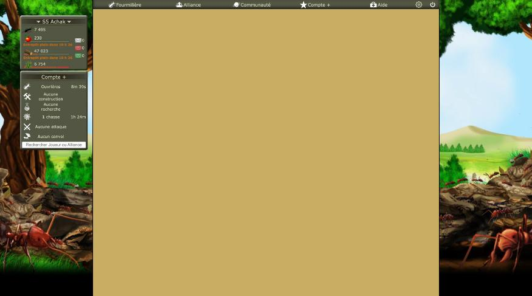
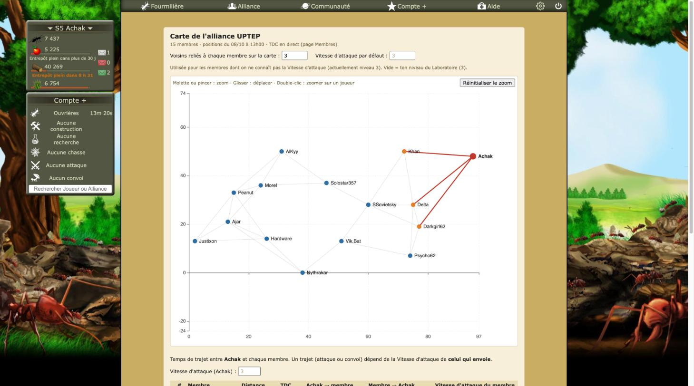
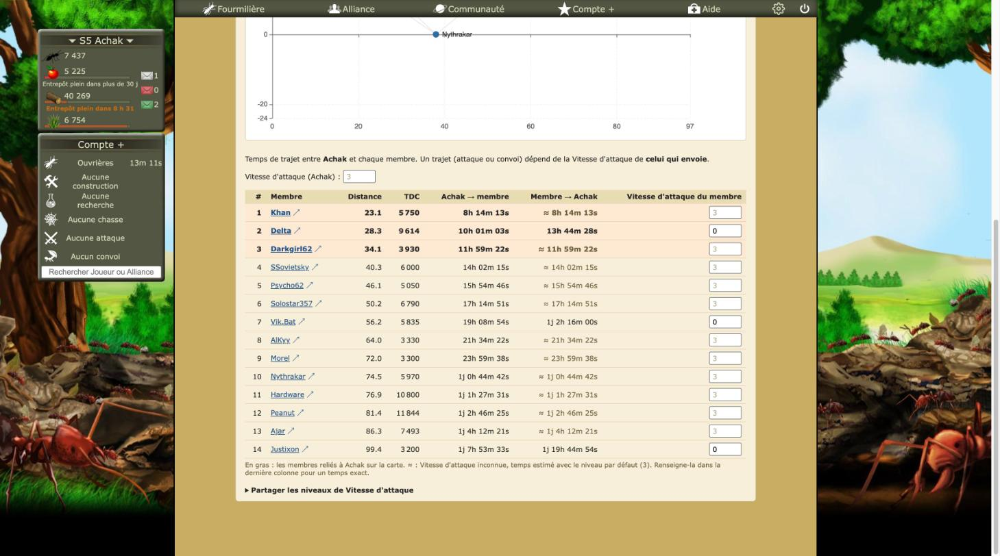
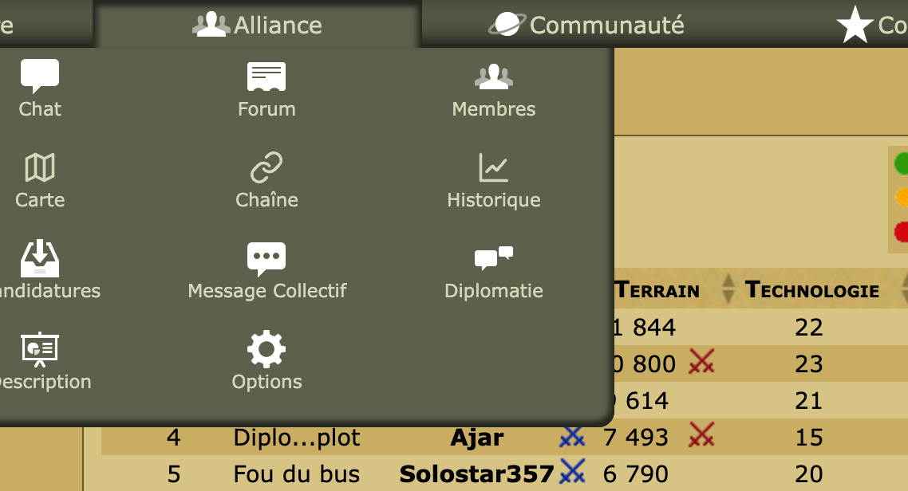

# Revue : Carte de l'alliance (`alliance-map`)

- Relecteur : sous-agent C
- Date : 2026-10-08
- Version : `package.json` 1.0.1, commit e228c3a (aucune modification non commitée hors `docs/reviews/`)
- Pages testées : `alliance.php?Membres`, `#carte`, `#chaine`, `#historique` (passage de l'une à l'autre par le hash et en rechargeant), `Membre.php?Pseudo=Delta` (temps de trajet du jeu), panneau « Paramètres » d'Optizzz (Carte coupée puis rallumée)
- Doc lue : `docs/features/alliance-map.md`, `docs/adr/0001-stack-ui-carte.md` (+ `docs/research/temps-de-trajet.md`, `docs/research/fourmizzz-api-exports.md`)

## Résumé

Au premier chargement de `#carte`, la vue fonctionne : graphe, infobulle, zoom, tableau, et une entrée de menu bien intégrée. Deux bugs touchent toutes les vues d'alliance. Une vue affichée une fois n'est plus jamais masquée : la réinitialisation `:host{all:initial !important}` de WXT l'emporte sur `display: none`. Et un lien `#carte` ouvert avec la Carte coupée donne une page vide. Le graphe, enfin, n'a pas la même échelle sur les deux axes : les distances y sont déformées d'environ 23 %.

| Bloquant | Majeur | Mineur | Suggestion |
| -------- | ------ | ------ | ---------- |
| 0        | 3      | 9      | 6          |

## Constats

### alliance-map-01 · Une vue d'alliance déjà ouverte ne se masque plus

- **Gravité** : majeur
- **Catégorie** : bug
- **Emplacement** : `src/entrypoints/alliance-map.content/index.tsx:54-58` ; même mécanisme dans `src/entrypoints/tdc-chain.content/index.tsx:53-57` et `src/entrypoints/history.content/index.tsx:57-61` ; cause dans `node_modules/wxt/dist/utils/content-script-ui/shadow-root.mjs:21`
- **Ce qui se passe** : pour masquer une vue, le script met `ui.shadowHost.style.display = "none"`. Or WXT injecte dans chaque Shadow DOM `/* WXT Shadow Root Reset */ :host{all:initial !important;}`. Une règle `!important` du Shadow DOM l'emporte sur le style en ligne de la page, si bien que l'hôte garde `display: inline` (vérifié par `getComputedStyle`). Reproduction : ouvrir `#historique`, puis cliquer « Carte », puis « Chaîne ». Les trois vues sont alors empilées et la Chaîne se trouve 2 469 px plus bas. Revenir sur « Membres » (hash vide) affiche la Carte et la Chaîne au-dessus du tableau du jeu. Seul un rechargement remet de l'ordre.
- **Ce qui est attendu** : une seule vue visible à la fois. Il faut masquer autrement : un attribut `hidden` ou une classe sur un conteneur interne, le démontage de la vue, ou `style.setProperty("display", "none", "important")`. La doc de la Chaîne dit « vérifié dans le jeu… bascule Carte / Chaîne / Membres » : il faut revérifier après correction.
- **Capture** :  (sur `alliance.php?Membres` sans hash, la Carte reste au-dessus du tableau)
- **Touche aussi** : tdc-chain, history

### alliance-map-02 · Feature coupée : `#carte` affiche une page vide

- **Gravité** : majeur
- **Catégorie** : bug
- **Emplacement** : `src/utils/alliance-views.ts:4-7` ; appelé par `src/entrypoints/tdc-chain.content/index.tsx:57` et `src/entrypoints/history.content/index.tsx:61`
- **Ce qui se passe** : Carte coupée dans les paramètres, j'ai ouvert `alliance.php?Membres#carte`, par exemple depuis un lien partagé, ce que la doc encourage. Les scripts de la Chaîne et de l'Historique masquent `#alliance` parce que `showsAllianceView()` reconnaît `#carte` sans regarder si la Carte est allumée. Aucune vue ne se monte : la page est vide, sans le tableau des membres.
- **Ce qui est attendu** : le tableau des membres quand la vue demandée est coupée. Il faut que `showsAllianceView` ne compte que les vues allumées, ou que chaque script ne masque `#alliance` que pour son propre hash.
- **Capture** : 
- **Touche aussi** : tdc-chain (`#chaine` avec la Chaîne coupée), history (`#historique` avec l'option coupée)

### alliance-map-03 · Les deux axes du graphe n'ont pas la même échelle

- **Gravité** : majeur
- **Catégorie** : bug
- **Emplacement** : `src/features/alliance-map/chart-option.ts:26-37,94-96` ; `MapChart.tsx:71`
- **Ce qui se passe** : `bounds()` donne bien le même intervalle aux deux axes (98 unités), mais la zone de tracé n'est pas carrée : environ 610 px de large pour 500 px de haut. Mesuré sur la capture : 6,3 px par case en x contre 5,1 px en y. Les distances verticales paraissent donc environ 23 % plus courtes, alors que la doc promet des « axes de même échelle » pour juger « qui est proche de qui ». Autres défauts visibles :
  - les bornes arrondies tombent sur des graduations bizarres (74, −24 et 97 aux extrémités ; 69.5, −19.6, 4.4 et 92.6 après un zoom, avec un point décimal) ;
  - l'axe y descend à −24 alors qu'aucune coordonnée n'est négative ;
  - l'étiquette « Nythrakar », sur y = 0, est barrée par l'axe.
- **Ce qui est attendu** : une zone de tracé carrée (calculer `grid` depuis la taille réelle, ou un repère `aspectScale` / `geo`), des graduations rondes, et des bornes limitées aux coordonnées du jeu.
- **Capture** :  ; après zoom : 
- **Touche aussi** : —

### alliance-map-04 · Deux lectures différentes de la Vitesse d'attaque

- **Gravité** : mineur
- **Catégorie** : cohérence
- **Emplacement** : `src/features/alliance-map/AllianceMap.tsx:19-22,48-54` ; `src/features/alliance-map/pages.ts:26-32` ; `src/features/game-levels/levels.ts:31-39,75-89`
- **Ce qui se passe** : la Carte télécharge `laboratoire.php` à chaque ouverture, lit le niveau avec son propre parseur (`.desciption_amelioration h2`) et le range dans ses propres réglages (`allianceMap:<host>:settings.labLevel`). La Chaîne, les Cibles et le Plan de flood lisent ce même niveau avec `loadLevelsOf` (`game-levels`, `.ligneAmelioration`, stocké dans `gameLevels:<host>`). La Chaîne combine même les deux (`TdcChain.tsx:113`). En jeu, les deux valeurs coïncidaient (niveau 3), mais elles peuvent diverger après une recherche.
- **Ce qui est attendu** : une seule source, `game-levels`.
- **Touche aussi** : tdc-chain, targets, flood

### alliance-map-05 · Formats de durée, de distance et de nombre différents des autres features

- **Gravité** : mineur
- **Catégorie** : cohérence
- **Emplacement** : `src/features/alliance-map/travel.ts:3-13` ; `NeighborTable.tsx:5,82` ; `chart-option.ts:24,116` ; à comparer avec `src/utils/time-format.ts:8-18` et `src/features/targets/mount.ts:234-235`
- **Ce qui se passe** : vu en jeu.
  - durées : la Carte écrit « 1j 0h 44m 42s » ou « 8h 14m 13s » ; les Cibles écrivent « 4 h 37 » ; le profil du jeu écrit « 10H 1m 2s ». Deux fonctions portent le même nom, `formatDuration`, l'une en secondes, l'autre en millisecondes ;
  - distance : « 23.1 », avec un point, sur la Carte ; « 1,4 » sur les Cibles ;
  - nombres : `Intl.NumberFormat` (espace fine insécable) ici, `formatNumber` (espace simple) ailleurs.
- **Ce qui est attendu** : un seul jeu de formateurs dans `src/utils/`, décimales à la française.
- **Capture** : 
- **Touche aussi** : tdc-chain, targets, flood, history

### alliance-map-06 · Message obsolète « chaque nuit à minuit »

- **Gravité** : mineur
- **Catégorie** : UX
- **Emplacement** : `src/features/alliance-map/AllianceMap.tsx:84-85` ; même texte dans `src/features/tdc-chain/TdcChain.tsx:173-174`
- **Ce qui se passe** : sans alliance dans l'export, la vue annonce une mise à jour « chaque nuit à minuit ». Or l'API est horaire : la Carte affichait « positions du 08/10 à 13h00 ». La note des Cibles dit d'ailleurs « mis à jour chaque heure ».
- **Ce qui est attendu** : « dans l'heure ».
- **Touche aussi** : tdc-chain, targets

### alliance-map-07 · La doc ne décrit pas les colonnes ni le marqueur réels

- **Gravité** : mineur
- **Catégorie** : doc
- **Emplacement** : `docs/features/alliance-map.md` (« Tableau », « Vitesse d'attaque », table « Code »)
- **Ce qui se passe** : la doc annonce des colonnes **Aller** / **Retour** et des temps marqués `*`. La vue affiche « Achak → membre », « Membre → Achak » et « ≈ ». La table « Code » attribue la formule à `travel.ts`, alors qu'elle est dans `src/game/travel.ts`.
- **Ce qui est attendu** : une doc alignée sur la vue.
- **Touche aussi** : —

### alliance-map-08 · Le champ de niveau du joueur sélectionné suggère le niveau par défaut, pas le sien

- **Gravité** : mineur
- **Catégorie** : UX
- **Emplacement** : `src/features/alliance-map/NeighborTable.tsx:29-40,49`
- **Ce qui se passe** : le placeholder vaut toujours le niveau par défaut, même pour moi, alors que les calculs utilisent mon niveau du Laboratoire (`neighbor-table.ts:27`). Les deux valaient 3 en jeu, ce qui masque l'écart. Il apparaît dès qu'un niveau par défaut est saisi.
- **Ce qui est attendu** : le niveau réellement utilisé comme placeholder.
- **Touche aussi** : —

### alliance-map-09 · Saisies numériques non bornées

- **Gravité** : mineur
- **Catégorie** : bug
- **Emplacement** : `src/features/alliance-map/NeighborTable.tsx:38` ; `AllianceMap.tsx:24,104-110,114-120`
- **Ce qui se passe** : « -3 », « 2.5 » ou « 99 » sont acceptés tels quels, et un niveau négatif allonge le trajet. Le champ « Voisins reliés » affiche la valeur stockée même quand `k` est plafonné (`AllianceMap.tsx:91`). En jeu, trois membres ont un niveau 0 saisi (Delta, Vik.Bat, Justixon) : rien ne distingue « 0 saisi » de « inconnu », sinon l'absence de « ≈ ».
- **Ce qui est attendu** : un entier entre 0 et 30, et le `k` réellement appliqué.
- **Touche aussi** : tdc-chain (lit ces niveaux)

### alliance-map-10 · Erreur brute affichée au joueur

- **Gravité** : mineur
- **Catégorie** : UX
- **Emplacement** : `src/features/alliance-map/AllianceMap.tsx:45,78`
- **Ce qui se passe** : `String(e)` affiche au joueur « Error: Fourmizzz API: 502 on https://… », ou un message zod en anglais. Je ne l'ai pas vu en jeu : l'API répondait.
- **Ce qui est attendu** : un message en français, et le détail dans la console.
- **Touche aussi** : tdc-chain, history

### alliance-map-11 · Couleurs et encadré différents des encarts du jeu et des autres encarts Optizzz

- **Gravité** : mineur
- **Catégorie** : UI
- **Emplacement** : `src/features/alliance-map/style.css:6-17` ; à comparer avec `src/features/flood/mount.ts:10-12` et `src/features/targets/mount.ts:8-10`
- **Ce qui se passe** : les vues React (Carte, Chaîne, Historique) ont un fond beige clair `#f6efd9`, des coins arrondis et une largeur de 900 px. Les encarts en DOM (Cibles) reprennent le fond `rgb(215, 195, 132)` et le bord carré des encadrés du jeu. En jeu, les Cibles paraissent natives et la Carte paraît plaquée, plus claire que la page. C'est le plus visible sur le profil, où « Progression » est plus étroit et plus clair que « Informations » et « Action », juste au-dessus et en dessous (voir history-04).
- **Ce qui est attendu** : une palette commune, celle des encadrés du jeu.
- **Capture** : 
- **Touche aussi** : tdc-chain, history, flood, targets

### alliance-map-12 · La molette au-dessus du graphe bloque le défilement de la page

- **Gravité** : mineur
- **Catégorie** : UX
- **Emplacement** : `src/features/alliance-map/chart-option.ts:97-100` ; `MapChart.tsx:71` (hauteur `min(640px, 85vw)`)
- **Ce qui se passe** : le graphe occupe environ 640 px sur les 812 de la fenêtre. Dix crans de molette vers le bas au-dessus du graphe n'ont pas fait défiler la page : la molette est prise par le zoom, qui était déjà au maximum. Pour atteindre le tableau, il faut viser une marge étroite ou passer par la barre de défilement.
- **Ce qui est attendu** : zoomer seulement avec Ctrl ou ⌘ + molette (`zoomOnMouseWheel: "ctrl"`) ou après un clic, et rendre la molette seule à la page.
- **Touche aussi** : —

### alliance-map-13 · Modules partagés rangés dans le dossier de la Carte

- **Gravité** : suggestion
- **Catégorie** : code
- **Emplacement** : `src/features/alliance-map/api.ts`, `pages.ts`, `dates.ts`, `travel.ts`, `neighbor-table.ts` ; `neighbors.ts:12-14` contre `src/game/travel.ts:13-15`
- **Ce qui se passe** : le client de l'API, `readLoggedInPseudo` et `formatExportVersion` servent aux Cibles, au Plan de flood, à la Chaîne et à l'Historique, et `levelOf` / `formatDuration` à la Chaîne. `distance` existe deux fois, à l'identique. La clé `local:allianceMap:<host>:playersExport` est lue par cinq features.
- **Ce qui est attendu** : `src/api/`, `src/game/` et `src/utils/`.
- **Touche aussi** : targets, flood, tdc-chain, history

### alliance-map-14 · Trois constructeurs d'entrée de menu presque identiques

- **Gravité** : suggestion
- **Catégorie** : code
- **Emplacement** : `src/features/alliance-map/menu.ts:12-37` ; `src/features/tdc-chain/menu.ts:14-41` ; `src/features/history/menu.ts:14-44`
- **Ce qui se passe** : le même code, styles en ligne compris, est copié trois fois, et chaque copie cherche les entrées des autres pour fixer l'ordre. L'ordre obtenu en jeu est bon (Membres, Carte, Chaîne, Historique), et il le reste quand la Carte est coupée.
- **Ce qui est attendu** : un utilitaire commun.
- **Touche aussi** : tdc-chain, history

### alliance-map-15 · Écriture en stockage dans un updater de `setState`

- **Gravité** : suggestion
- **Catégorie** : code
- **Emplacement** : `src/features/alliance-map/AllianceMap.tsx:33-42` ; même schéma dans `TdcChain.tsx:74-83`, `AllianceHistory.tsx:42-51` et `ProfileHistory.tsx:30-39`
- **Ce qui se passe** : `writeSettings` est appelé dans la fonction passée à `setSettings`, que React peut appeler deux fois.
- **Ce qui est attendu** : un hook commun `useStoredSettings`, qui écrit dans un effet.
- **Touche aussi** : tdc-chain, history

### alliance-map-16 · Pas de test sur l'option du graphe ni sur le passage d'une vue à l'autre

- **Gravité** : suggestion
- **Catégorie** : code
- **Emplacement** : `src/features/alliance-map/chart-option.ts` ; `src/entrypoints/*.content/index.tsx` ; `src/utils/alliance-views.ts`
- **Ce qui se passe** : alliance-map-01 à 03 auraient été repérés par un test du passage d'une vue à l'autre (et de la réinitialisation WXT), un test de `showsAllianceView` avec une vue coupée, et un test des bornes du graphe.
- **Ce qui est attendu** : des tests de `buildChartOption` et de `showsAllianceView`.
- **Touche aussi** : tdc-chain, history

### alliance-map-17 · Le jeu affiche lui-même distance et trajet sur le profil

- **Gravité** : suggestion
- **Catégorie** : doc
- **Emplacement** : `docs/research/temps-de-trajet.md` (« À vérifier », « Mesures »)
- **Ce qui se passe** : `Membre.php?Pseudo=Delta` affiche « Distance : 29 » et « Temps de trajet : 10H 1m 2s », calculés par le jeu avec ma Vitesse d'attaque. La Carte donne 28.3 et 10h 01m 03s pour le même couple (niveau 3), soit une seconde d'écart : la formule est confirmée, à l'arrondi près (voir Q1). La doc de recherche ne cite pas cette source, plus simple que le simulateur Compte+.
- **Ce qui est attendu** : ajouter la mesure et la source à `temps-de-trajet.md`, et un cas de test dans `src/game/travel.test.ts`.
- **Touche aussi** : targets, flood, tdc-chain

### alliance-map-18 · Icônes du menu en trait fin, celles du jeu sont pleines

- **Gravité** : suggestion
- **Catégorie** : UI
- **Emplacement** : `src/features/alliance-map/menu.ts:7-9` (et les icônes de la Chaîne et de l'Historique)
- **Ce qui se passe** : les entrées s'insèrent bien dans la grille du menu d'alliance (couleur, taille, alignement), mais leurs icônes vectorielles en trait fin contrastent avec les pictogrammes pleins du jeu.
- **Ce qui est attendu** : des icônes pleines, dans le style du sprite du jeu.
- **Capture** : 
- **Touche aussi** : tdc-chain, history

## Questions ouvertes

### Q1 · Arrondi du temps de trajet

- **Observation** : pour Achak (95 ; 48) vers Delta (75 ; 28), avec une Vitesse d'attaque de 3, la Carte donne 10h 01m 03s et le profil du jeu 10H 1m 2s.
- **Hypothèses** : 1) le jeu arrondit à l'entier inférieur (`floor`) et la formule utilise `ceil` ; 2) la constante diffère d'une fraction de seconde.
- **Comment trancher** : relever 2 ou 3 autres couples sur des profils (`Membre.php`) et comparer.

### Q2 · Sens de l'axe y

- **Observation** : le graphe place y = 0 en bas. Je n'ai pas vérifié dans quel sens va l'axe y sur la carte du jeu (`carte.php`).
- **Hypothèses** : 1) le même sens ; 2) y croissant vers le bas, auquel cas la Carte est inversée de haut en bas par rapport au jeu.
- **Comment trancher** : ouvrir la carte du jeu et comparer deux membres.

## Préparation au mode « moderne »

- **Facilite** : Shadow DOM, avec toutes les couleurs de la vue dans un seul fichier, `style.css`.
- **Bloque** :
  - aucune variable CSS : les couleurs sont en dur dans `style.css` ;
  - les couleurs du graphe sont codées en JS (`chart-option.ts:13-20,70`) ;
  - le même bloc CSS est recopié dans `tdc-chain/style.css` et `history/style.css` ;
  - l'icône du menu a des styles en ligne (`menu.ts:23-26`).

  Attention aussi : la réinitialisation `:host{all:initial !important}` de WXT écrase tout style posé de l'extérieur sur l'hôte (voir alliance-map-01). Un thème devra passer par l'intérieur du Shadow DOM.

## Hors périmètre / non testé

- **Petites largeurs** : `resize_window` est inopérant, et le jeu a une mise en page fixe. Simuler 800 px en réduisant `body` (par `javascript_tool`) casse la page du jeu elle-même (`#centre` réduit à 180 px), donc le test n'est pas représentatif pour la Carte. Le tableau de la Carte a `overflow-x: auto` (code). Simulation annulée.
- **Partage des niveaux** : l'import n'a pas été cliqué, et aucun niveau n'a été modifié (réglages laissés tels quels : `k` = 3, aucun niveau par défaut saisi).
- Clic et double-clic sur un joueur : non testés (seulement le survol et la molette). Le zoom a été remis par « Réinitialiser le zoom ».
- Carte coupée puis rallumée dans les paramètres : état initial (toutes les features allumées) rétabli et vérifié.
- Console : aucune erreur Optizzz sur `alliance.php` ni sur `Membre.php`.
