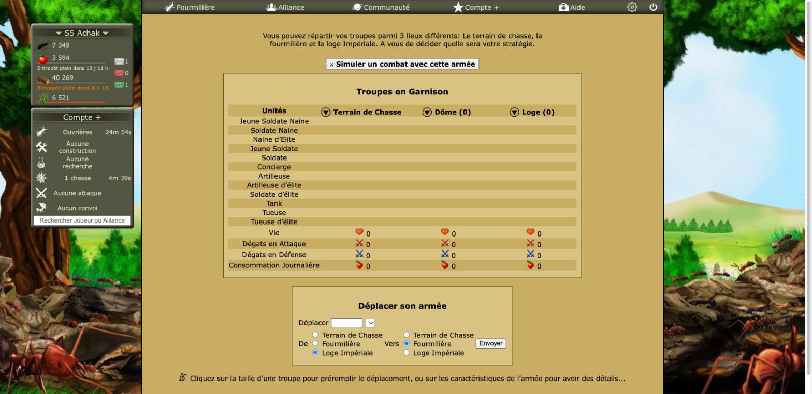
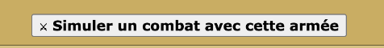
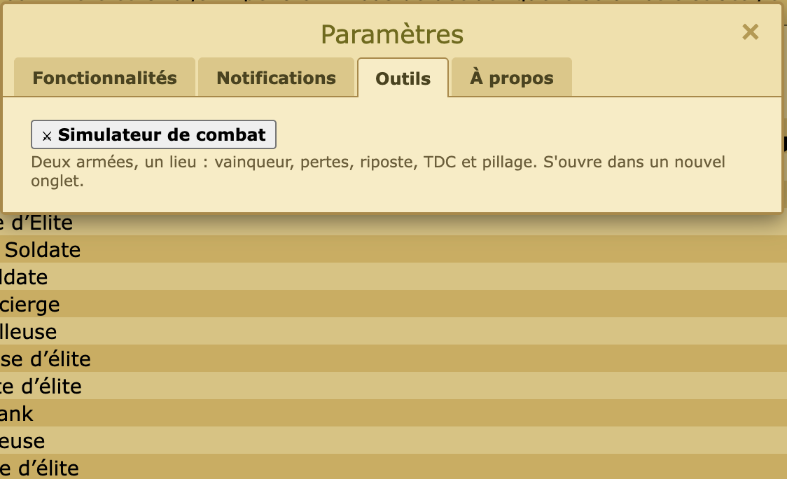

# Revue : Simulateur de combat (`combat-simulator`)

- Relecteur : sous-agent B
- Date : 2026-10-08
- Version : `package.json` 1.0.1, commit e228c3a
- Pages testées : `Armee.php` (armée en chasse puis rentrée), `Reine.php` (fiches des unités), Paramètres > Outils et Fonctionnalités. **La page du simulateur elle-même n'a pas pu être testée** (voir « Hors périmètre »).
- Doc lue : `docs/features/combat-simulator.md` (+ `docs/research/combat.md`)

## Résumé

Le moteur est partagé avec la chasse (`rounds.ts`). Les stats des 12 unités affichées sur `Reine.php` correspondent exactement à `UNITS`, Tank à 35 de vie compris (Calystene en donne 30, écart déjà documenté). Le bouton d'`Armee.php` et l'interrupteur marchent. Problème principal, tiré du code : « Je défends / J'attaque avec mon armée » efface tout le formulaire, armée adverse comprise. En jeu, deux défauts visibles : le glyphe « ⚔ » s'affiche comme un « × », et passer sur `Armee.php` pendant une chasse mémorise une armée vide.

| Bloquant | Majeur | Mineur | Suggestion |
| -------- | ------ | ------ | ---------- |
| 0        | 1      | 5      | 4          |

## Constats

### combat-simulator-01 · Changer de côté efface l'armée adverse et tous les niveaux

- **Gravité** : majeur
- **Catégorie** : UX
- **Emplacement** : `src/features/combat-simulator/CombatSimulator.tsx:228-236`
- **Ce qui se passe** : le bouton fait `setForm(emptyForm())` puis bascule le côté ; le pré-remplissage ne remet que le côté du joueur. L'armée ennemie collée depuis un rapport, ses niveaux, son TDC, ses ressources et le lieu visé sont perdus. Cas typique : on colle l'armée d'un attaquant, on clique « Je défends avec mon armée », et l'attaquant disparaît. (Lu dans le code, page non testée en jeu.)
- **Ce qui est attendu** : ne remplacer que le côté du joueur (ou échanger les deux côtés), sans toucher à l'autre.
- **Touche aussi** : —

### combat-simulator-02 · Passer sur `Armee.php` pendant une chasse mémorise une armée vide

- **Gravité** : mineur
- **Catégorie** : UX
- **Emplacement** : `src/features/combat-simulator/index.ts:17-20` ; `garrison.ts:19-35` ; `Armee.php`
- **Ce qui se passe** : à 13 h 12, toute l'armée était en chasse : « Troupes en Garnison » vide. La feature a quand même écrit cette garnison vide (avec une nouvelle date de lecture) par-dessus la précédente. Ouvert à ce moment-là, le simulateur pré-remplirait « J'attaque » avec 0 unité, et « armée lue le … » ferait croire à une donnée fraîche. Pour un joueur qui chasse sans arrêt, c'est l'état le plus courant.
- **Ce qui est attendu** : ne pas écraser une garnison connue par une garnison vide (ou ajouter les troupes en chasse lues sur `Ressources.php` avec Compte+), et le signaler (« armée en chasse »).
- **Capture** : 
- **Touche aussi** : flood (si elle lit aussi l'armée mémorisée)

### combat-simulator-03 · Le glyphe « ⚔ » s'affiche comme un « × »

- **Gravité** : mineur
- **Catégorie** : UI
- **Emplacement** : `src/features/combat-simulator/index.ts:28` ; `src/features/settings/tools-section.ts:19` ; `Armee.php` et Paramètres > Outils
- **Ce qui se passe** : dans la police du jeu, « ⚔ Simuler un combat avec cette armée » et « ⚔ Simulateur de combat » commencent par un petit « × », qui se lit comme « fermer ». Le bouton est par ailleurs un bouton natif gris, centré au-dessus du tableau.
- **Ce qui est attendu** : une icône (SVG ou image du jeu) plutôt qu'un caractère Unicode, et un bouton au style du jeu.
- **Capture** :  
- **Touche aussi** : settings (onglet Outils), toute feature qui utilise des glyphes Unicode (🐜 du lanceur)

### combat-simulator-04 · Riposte « à 50 % » : l'attaque affichée ne suffit pas

- **Gravité** : mineur
- **Catégorie** : bug
- **Emplacement** : `src/game/army/battle.ts:112-115` ; `src/game/army/rounds.ts:23-27`
- **Ce qui se passe** : `requiredAttack` donne exactement 1,5 / 2 / 3 fois la vie des défenseurs, mais `overkillFactor` exige un rapport **strictement** supérieur (`ratio > 1.5`). Avec l'attaque affichée, le moteur donne encore une riposte à 100 % (resp. 50 %, 30 %).
- **Ce qui est attendu** : la même borne des deux côtés (voir Q1), avec un test.
- **Touche aussi** : flood (si elle s'appuie sur `requiredAttack` ou `overkillFactor`)

### combat-simulator-05 · Portée 300 % : borne incluse alors que la recherche la dit exclue

- **Gravité** : mineur
- **Catégorie** : bug
- **Emplacement** : `src/features/combat-simulator/CombatSimulator.tsx:192-193`
- **Ce qui se passe** : `ratio > 3` ne signale pas un défenseur à exactement 300 %, que `docs/research/combat.md` donne hors de portée (« 300 % exclu », bornes d'`ennemie.php`).
- **Ce qui est attendu** : `ratio >= 3`, et une seule règle de portée dans `src/game/` pour toutes les features.
- **Touche aussi** : targets, flood

### combat-simulator-06 · Niveaux inconnus mis à 0 sans le dire

- **Gravité** : mineur
- **Catégorie** : UX
- **Emplacement** : `src/features/combat-simulator/form.ts:65-66`, `:81` ; `CombatSimulator.tsx:154`
- **Ce qui se passe** : la page ne lit que les niveaux mémorisés (`loadStoredLevels`), sans `fetch` du Laboratoire. Si le joueur n'y est jamais passé, Armes et Bouclier valent 0 sans message, et le résultat paraît fiable.
- **Ce qui est attendu** : « Armes et Bouclier inconnus : passez au Laboratoire », comme dans `hunt-reports`.
- **Touche aussi** : hunt-launcher, game-levels

### combat-simulator-07 · Tableau du défenseur large

- **Gravité** : suggestion
- **Catégorie** : UI
- **Emplacement** : `src/entrypoints/combat-simulator/style.css:75-85`, `:127-130`
- **Ce qui se passe** : 14 lignes × 3 lieux, des champs de 90 px plus la colonne des noms, soit environ 400 px au minimum sans `overflow-x`. Risque de débordement sous 800 px. Non vérifié : page non ouverte (voir « Hors périmètre »).
- **Ce qui est attendu** : un défilement horizontal ou des champs plus étroits.
- **Touche aussi** : —

### combat-simulator-08 · « Je défends » ne remplit pas nourriture et matériaux

- **Gravité** : suggestion
- **Catégorie** : UX
- **Emplacement** : `src/features/combat-simulator/form.ts:85-102`
- **Ce qui se passe** : en défense, l'armée, le Dôme, la Loge et le TDC sont repris, mais pas le stock (lisible dans l'en-tête d'`Armee.php`), qui sert au pillage.
- **Ce qui est attendu** : mémoriser aussi le stock avec la garnison.
- **Touche aussi** : —

### combat-simulator-09 · Couleurs en dur, recopiées d'une feature à l'autre

- **Gravité** : suggestion
- **Catégorie** : UI
- **Emplacement** : `src/entrypoints/combat-simulator/style.css` (`#efe0ad`, `#6b5d3a`, `#a01010`, `#2f6b12`…) ; `src/features/combat-simulator/index.ts:6`
- **Ce qui se passe** : la palette « parchemin » propre à la page est proche de celle du lanceur de chasse, mais pas identique (`#a02020` contre `#a01010`, `#2f6b1a` contre `#2f6b12`, `#f6efd9` contre `#f7ecc6`).
- **Ce qui est attendu** : un fichier de tokens partagé par toutes les UI React et les features légères.
- **Touche aussi** : hunt-launcher, alliance-map, tdc-chain, history

### combat-simulator-10 · Page testée au montage seulement

- **Gravité** : suggestion
- **Catégorie** : code
- **Emplacement** : `src/features/combat-simulator/CombatSimulator.test.tsx` ; `__fixtures__/armee.html`
- **Ce qui se passe** : ni la bascule de côté (01), ni la portée (05), ni le collage par lieu ne sont testés ; aucune fixture d'`Armee.php` avec la garnison vide (02).
- **Ce qui est attendu** : des tests de ces cas, ou ces règles sorties en fonctions pures dans `form.ts` / `garrison.ts`.
- **Touche aussi** : —

## Questions ouvertes

### Q1 · Surpuissance : « 1,5 fois » strict ou inclus ?

- **Observation** : le tutoriel dit « 1,5 / 2 / 3 fois la vie » ; le moteur prend `>`, l'affichage `=`.
- **Hypothèses** : 1) seuil inclus (≥) ; 2) seuil strict (>).
- **Comment trancher** : un rapport dont le rapport attaque / vie tombe pile sur un seuil, sinon Outiiil ou Calystene.

### Q2 · Gains d'une attaque de la Loge

- **Observation** : cible Loge → « la fourmilière devient votre colonie », sans TDC ni pillage des lieux traversés (`battle.ts:144`), point non tranché dans `combat.md`.
- **Hypothèses** : 1) seule la colonie ; 2) TDC et pillage en plus.
- **Comment trancher** : un vrai rapport ([#1](https://github.com/Achaak/Optizzz/issues/1)).

## Préparation au mode « moderne »

- **Facilite** : page autonome, une seule feuille `style.css`, classes sémantiques (`won`, `lost`, `warning`, `note`).
- **Bloque** : couleurs et tailles en dur, sans variables ; palette recopiée, avec de petits écarts, de celle du lanceur ; glyphe Unicode comme icône ; aucun composant partagé (champ numérique, bandeau d'avertissement).

## Hors périmètre / non testé

- **Page du simulateur** (`combat-simulator.html`) : le bouton d'`Armee.php` l'ouvre par `tabs.create` depuis l'arrière-plan, **hors du groupe d'onglets de la revue**. On ne peut donc ni la piloter, ni la fermer depuis l'outil de test, et l'identifiant de l'extension (non épinglé, pas de `key` dans le manifeste) n'est pas lisible pour y naviguer directement. Un clic a été fait sur le bouton à 13 h 12 : **un onglet « Simulateur de combat · Optizzz » est probablement resté ouvert dans le Chrome du joueur**. Pré-remplissage, collage, bascule de côté, portée et largeurs restent à vérifier à la main.
- Vérifié en jeu : bouton présent et placé au-dessus de « Troupes en Garnison » ; feature coupée → plus de bouton après rechargement ; onglet « Outils » présent ; feature réactivée. La garnison mémorisée a été relue après le retour de la chasse (2 633 JSN, 274 SN, 8 NE en Fourmilière).
- `Reine.php` : vie / attaque / défense des 12 unités affichées identiques à `UNITS` (Concierge d'élite et Tank d'élite absents de la page). Les bonus affichés (×1,4 en vie, ×1,5 en attaque) donnent Bouclier 4 et Armes 5 sur ce compte.
- Console d'`Armee.php` : aucune erreur Optizzz.
