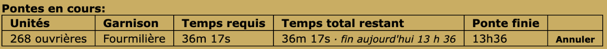
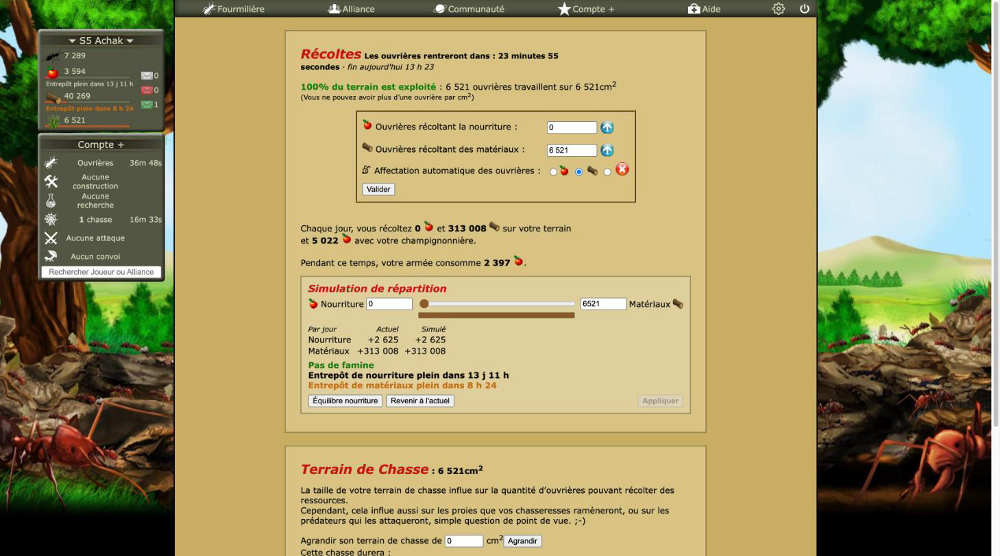

# Revue : Heures de fin (`end-times`)

- Relecteur : sous-agent A
- Date : 2026-10-08
- Version : `package.json` 1.0.1, commit e228c3a, build `chrome-mv3-dev` chargé dans Chrome
- Pages testées : Ressources.php, Reine.php, construction.php, laboratoire.php, Armee.php (S5, compte avec Compte+) ; option « À côté des décomptes » coupée puis rétablie
- Doc lue : `docs/features/end-times.md` (+ `docs/research/fourmizzz-pages.md` : `reste()`, `#menuBoite`, `#boiteComptePlus`)

## Résumé

Les deux parties (heure à côté des décomptes, encart « Prochaines fins ») sont simples et la logique est bien testée (`recap`, `store`, `sources`, `countdowns`). En jeu, l'heure s'ajoute bien au retour des ouvrières et à la ponte, et ne double pas « Arrivée à 13h15 » sous la chasse ; mais elle double la colonne « Ponte finie » de la Reine avec Compte+. L'encart n'a pas pu être vu (Compte+ le masque par conception). Côté code, la relecture en arrière-plan (jusqu'à 5 `GET`) n'a pas de cache commun avec les Prévisions de ressources, et la feature sert en silence de source aux notifications des Alertes.

| Bloquant | Majeur | Mineur | Suggestion |
| -------- | ------ | ------ | ---------- |
| 0        | 0      | 5      | 5          |

## Constats

### end-times-01 · Heure de fin en double sur la Reine avec Compte+

- **Gravité** : mineur
- **Catégorie** : bug
- **Emplacement** : Reine.php, tableau « Pontes en cours » ; `src/features/end-times/countdowns.ts:32-41`
- **Ce qui se passe** : avec Compte+, le tableau du jeu a une colonne « Ponte finie » (« 13h36 »). Optizzz ajoute quand même « · fin aujourd'hui 13 h 36 » dans la cellule « Temps total restant », juste à côté. `gameShowsEndTime` ne regarde que les éléments qui suivent le décompte (« Arrivée à », « Terminé à »), pas les autres cellules de la ligne.
- **Ce qui est attendu** : pas d'ajout quand la ligne du tableau a déjà une heure de fin (cellule « Ponte finie », ou texte `\d+h\d+` dans la même `tr`). La doc (« Pas d'ajout quand le jeu donne déjà l'heure ») le prévoit.
- **Capture** : 
- **Touche aussi** : laying-planner (même page)

### end-times-02 · Doc en retard sur le code (convois, alertes)

- **Gravité** : mineur
- **Catégorie** : doc
- **Emplacement** : `docs/features/end-times.md` (« Hors v1 », « Données ») ; `src/features/end-times/sources.ts:22-27, 51-54`
- **Ce qui se passe** : les convois (`commerce.php`) sont rangés sous « Hors v1 » mais sont lus et affichés (« 🐜 Convoi → X »). « Les alertes (feature 6) réutiliseront ces données » : c'est fait (`alerts/background.ts:37-39`), et la doc ne dit pas que couper la feature coupe aussi deux notifications.
- **Ce qui est attendu** : déplacer les convois dans le comportement, citer les notifications d'Alertes comme lecteur des données.
- **Capture** : —
- **Touche aussi** : alerts, convoy

### end-times-03 · Relectures en arrière-plan sans cache commun avec les Prévisions

- **Gravité** : mineur
- **Catégorie** : code
- **Emplacement** : `src/features/end-times/index.ts:55-59`, `src/features/end-times/store.ts:37-50` ; `src/features/resource-forecast/index.ts:51`, `src/features/resource-forecast/income.ts:51-66, 79-95`
- **Ce qui se passe** : sans Compte+, l'encart relit chaque page source jamais lue ou lue il y a plus de 15 min (Ressources, Reine, construction, laboratoire, commerce : jusqu'à 5 `GET` à la suite). Les Prévisions relisent de leur côté `Ressources.php` à chaque affichage de Construction/Laboratoire et `construction.php` à chaque affichage du Laboratoire, avec leur propre cache (relevé en jeu sur laboratoire.php : 2 `GET`, `Ressources.php` et `construction.php`). Sans Compte+, une même page peut donc être lue deux fois au même chargement, et chaque onglet relit pour lui.
- **Ce qui est attendu** : un seul cache par page du jeu, partagé par les features, et une seule relecture en cours par page.
- **Capture** : —
- **Touche aussi** : resource-forecast, alerts

### end-times-04 · Écriture du stockage sans sérialisation

- **Gravité** : mineur
- **Catégorie** : code
- **Emplacement** : `src/features/end-times/store.ts:27-34`
- **Ce qui se passe** : `storeSection` lit puis réécrit tout l'objet du serveur sans file d'attente, alors que `alerts/store.ts:13-26` et `toggles.ts:46-55` sérialisent leurs écritures pour ce cas précis. Deux onglets (ou la relecture d'un onglet et le chargement d'un autre) peuvent perdre une section.
- **Ce qui est attendu** : même protection que les autres stores (ou un utilitaire commun de lecture-modification-écriture).
- **Capture** : —
- **Touche aussi** : alerts (lit ces sections)

### end-times-05 · Titre de l'encart d'apparence cliquable, sans action

- **Gravité** : mineur
- **Catégorie** : UX
- **Emplacement** : `src/features/end-times/mount-recap.ts:37` (`
<a>Prochaines fins</a>
`)
- **Ce qui se passe** : le titre reprend la classe « cliquable » du jeu et un `<a>` sans `href` ; rien ne se passe au clic. Non vu en jeu : le compte a Compte+, l'encart n'est donc pas monté.
- **Ce qui est attendu** : soit un titre non cliquable, soit une action (replier l'encart).
- **Capture** : — (encart masqué avec Compte+)
- **Touche aussi** : —

### end-times-06 · Ajout placé dans le titre « Récoltes »

- **Gravité** : suggestion
- **Catégorie** : UI
- **Emplacement** : Ressources.php, en-tête « Récoltes » (`retour_ouvrieres`)
- **Ce qui se passe** : « · fin aujourd'hui 13 h 23 » s'ajoute dans la ligne de titre en gras « Les ouvrières rentreront dans : 23 minutes 55 secondes », qui passe alors sur deux lignes (« secondes · fin aujourd'hui 13 h 23 » seul en dessous). Lisible, mais l'heure d'une récolte qui revient toutes les 30 min a peu d'intérêt et alourdit le titre.
- **Ce qui est attendu** : à juger ; on pourrait exclure `retour_ouvrieres` comme `temps_restant_premiere_ponte`.
- **Capture** : 
- **Touche aussi** : —

### end-times-07 · Heure de fin des pages relues décalée de la durée des requêtes

- **Gravité** : suggestion
- **Catégorie** : code
- **Emplacement** : `src/features/end-times/index.ts:57`, `src/features/end-times/store.ts:42`
- **Ce qui se passe** : les sections relues sont datées avec `loadedAt` (chargement de la page courante) et non avec l'heure de réponse de chaque `GET`. Les 5 requêtes étant faites l'une après l'autre, les heures de fin sont un peu trop tôt (quelques secondes).
- **Ce qui est attendu** : `new Date()` au moment de chaque réponse.
- **Capture** : —
- **Touche aussi** : —

### end-times-08 · Lecteurs de pages répartis dans plusieurs features

- **Gravité** : suggestion
- **Catégorie** : code
- **Emplacement** : `src/features/end-times/sources.ts:3-5`
- **Ce qui se passe** : `sources.ts` importe `readHunts` de `resource-forecast/pages`, `readWorkQueue` de `work-queue/queue` et `readConvoysOnWay` de `convoy/convoy`. Les lecteurs de pages du jeu vivent dans la feature qui les a créés, et les features dépendent les unes des autres.
- **Ce qui est attendu** : un dossier commun des lecteurs de pages (par ex. `src/game/pages/`), comme `src/game/` pour les règles.
- **Capture** : —
- **Touche aussi** : work-queue, resource-forecast, convoy, alerts

### end-times-09 · Libellés d'un même chantier différents selon l'endroit

- **Gravité** : suggestion
- **Catégorie** : cohérence
- **Emplacement** : `src/features/end-times/sources.ts:58` (« Champignonnière 9 ») ; `src/features/work-queue/mount.ts:55` (« Champignonnière 8 → 9 ») ; notification « chantier terminé · Champignonnière 9 »
- **Ce qui se passe** : trois formats pour le même chantier. Le jeu écrit « Champignonnière 9 ».
- **Ce qui est attendu** : choisir une forme et la documenter.
- **Capture** : —
- **Touche aussi** : work-queue, alerts

### end-times-10 · Mise en page absolue et couleurs codées en dur

- **Gravité** : suggestion
- **Catégorie** : UI
- **Emplacement** : `src/features/end-times/mount-recap.ts:9-20, 49`
- **Ce qui se passe** : l'encart est en `position: absolute; left: 65px; width: 220px`, couleur `rgb(211, 217, 184)`, hauteur de titre supposée 25 px, et décale `#boiteComptePlus` en recalculant son `top`. `#menuBoite` est fixe (vérifié : `position: fixed`) et fait 500 px de haut d'après la doc de recherche : avec beaucoup de lignes, l'encart plus la boîte Compte+ peuvent sortir de l'écran sur un petit portable, sans défilement possible. Les lignes ajoutées sous les jauges par les Prévisions agrandissent aussi `#boiteInfo` (vu en jeu : ça tient avec Compte+).
- **Ce qui est attendu** : des tokens de couleur ; une mise en page qui ne dépende pas de mesures en px du jeu.
- **Capture** : —
- **Touche aussi** : resource-forecast (lignes sous les jauges)

## Questions ouvertes

### Q1 · Heure locale ou heure du serveur ?

- **Observation** : « · fin aujourd'hui 13 h 36 » est à l'heure du navigateur, à côté du « 13h36 » du jeu (Reine), qui est à l'heure du serveur. Identiques ici (navigateur en France).
- **Hypothèses** : 1) sans effet pour un joueur en France ; 2) deux heures différentes côte à côte pour un joueur dans un autre fuseau.
- **Comment trancher** : décision produit.

### Q2 · Format « 13 h 36 » à côté du « 13h36 » du jeu

- **Observation** : l'extension écrit « 13 h 36 », « 1 h 25 » ; le jeu « 13h36 », « 36m 19s », « 1H 2m 37s ». Choix typographique délibéré ou non ?
- **Comment trancher** : question au joueur (cohérence avec le jeu contre lisibilité).

## Préparation au mode « moderne »

- **Facilite** : classes préfixées (`optizzz-end-time`, `optizzz-recap*`), rendu de l'encart séparé du choix des lignes (`recap.ts`).
- **Bloque** : réutilisation des classes du jeu (`titre_colonne_cliquable`, `contenu_boite_compte_plus`) qui lie l'aspect au thème du jeu ; couleurs et positions en px codées en dur (`mount-recap.ts:14-20`) ; icônes emoji (rendu variable selon le système).

## Hors périmètre / non testé

- Encart « Prochaines fins » : le compte a Compte+, l'encart n'est donc jamais monté (voulu). Rendu, position, chevauchements et relectures en arrière-plan de l'encart non vus en jeu.
- Chantiers et recherches en cours : aucun sur le compte pendant la revue. Attaques et convois en cours : aucun.
- Petites largeurs (~800 px, ~400 px) : le redimensionnement de la fenêtre par l'outil n'a eu aucun effet ; non testé.
- En jeu : libellé d'une ponte dans les données = texte de la cellule « Unités » (« 269 ouvrières »), qui baisse au fil de la ponte ; sans conséquence pour l'encart.
