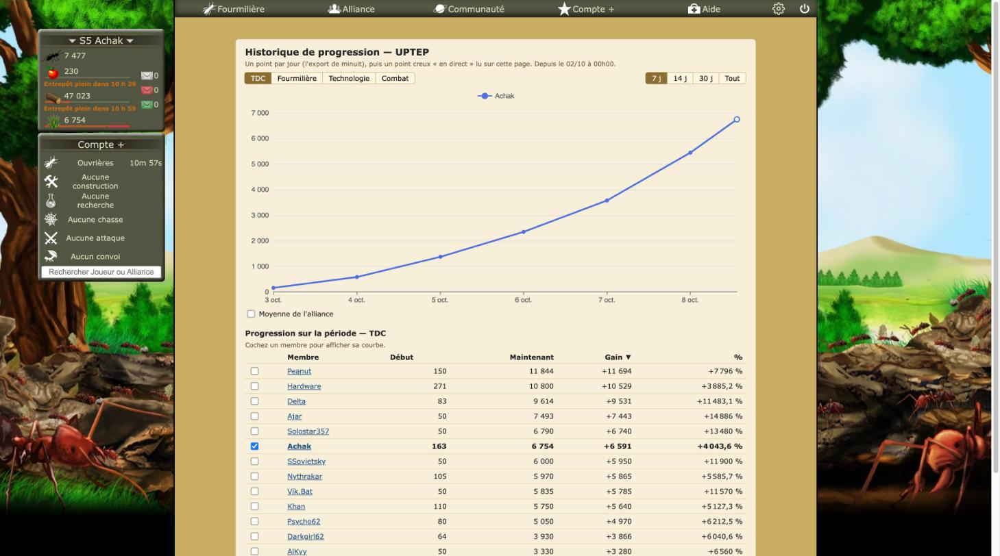
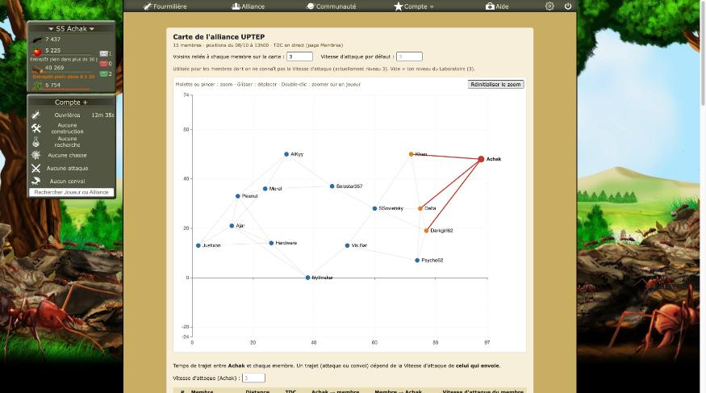
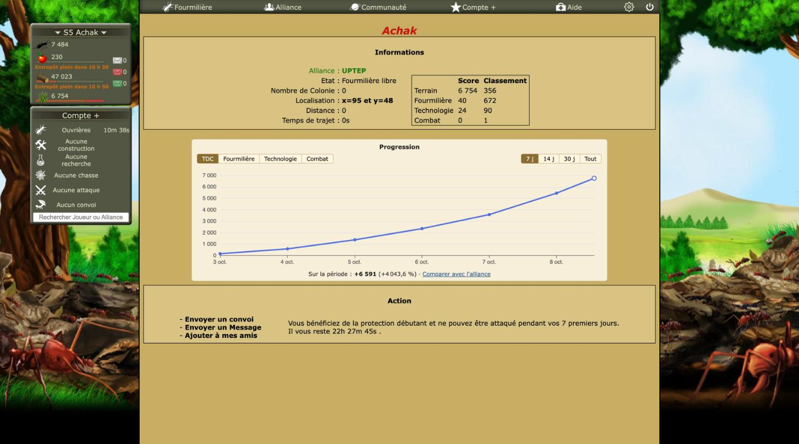

# Revue : Historique de progression (`history`)

- Relecteur : sous-agent C
- Date : 2026-10-08
- Version : `package.json` 1.0.1, commit e228c3a (aucune modification non commitée hors `docs/reviews/`)
- Pages testées : `alliance.php?Membres#historique` (chargée directement, puis passage vers `#carte` et `#chaine`), `Membre.php?Pseudo=Achak` (mon profil), `Membre.php?Pseudo=Delta` (membre de l'alliance)
- Doc lue : `docs/features/historique.md` (+ `docs/research/fourmizzz-api-exports.md`, `docs/research/fourmizzz-pages.md` « Membre.php »)

## Résumé

La vue d'alliance et l'encart du profil fonctionnent. On y trouve une courbe par jour avec un point creux « en direct », des onglets et des périodes, un tableau trié par gain avec une flèche ▼, des réglages partagés entre les deux vues (7 j, TDC), et aucune erreur dans la console. Le défaut majeur est commun aux trois vues d'alliance : une fois ouvert, l'Historique reste affiché au-dessus de la Carte et de la Chaîne (alliance-map-01). Sur le profil, l'encart « Progression » paraît plaqué entre les deux encadrés du jeu. Côté code, un score absent est lu comme 0.

| Bloquant | Majeur | Mineur | Suggestion |
| -------- | ------ | ------ | ---------- |
| 0        | 1      | 5      | 6          |

Vue d'ensemble : 

## Constats

### history-01 · L'Historique reste affiché après un passage vers la Carte ou la Chaîne

- **Gravité** : majeur
- **Catégorie** : bug
- **Emplacement** : `src/entrypoints/history.content/index.tsx:57-61` ; `src/utils/alliance-views.ts:4-7`
- **Ce qui se passe** : en jeu, j'ai ouvert `#historique` puis cliqué « Carte » et « Chaîne ». L'Historique reste en haut de la page (y = 67) et les autres vues s'empilent dessous. La réinitialisation `:host{all:initial !important}` de WXT annule `display: none` (alliance-map-01). Par le même code, `#historique` avec l'option « Entrée Historique » coupée masque le tableau des membres sans rien afficher à la place (alliance-map-02).
- **Ce qui est attendu** : une seule vue visible, et le tableau des membres quand l'option est coupée.
- **Capture** : voir 
- **Touche aussi** : alliance-map, tdc-chain

### history-02 · Un score absent du profil devient 0 dans la courbe

- **Gravité** : mineur
- **Catégorie** : bug
- **Emplacement** : `src/features/history/pages.ts:15-27` ; `ProfileHistory.tsx:44-48`
- **Ce qui se passe** : `readProfile` part de scores à 0. Si une ligne manque ou change de libellé, le point « en direct » vaut 0 : la courbe chute et le total affiche −100 %. En jeu, sur S5, les quatre lignes (Terrain, Fourmilière, Technologie, Combat) étaient présentes et lues correctement : le profil d'Achak indiquait « +6 591 (+4 043,6 %) ».
- **Ce qui est attendu** : `Partial<Scores>`, sans point en direct pour un score absent.
- **Touche aussi** : —

### history-03 · Changer de période n'arrête pas les téléchargements en cours

- **Gravité** : mineur
- **Catégorie** : code
- **Emplacement** : `src/features/history/useHistory.ts:34-53` ; `src/features/history/api.ts:87-104`
- **Ce qui se passe** : le drapeau `cancelled` bloque seulement la mise à jour de l'état, pas la boucle de `loadHistory`. Après « Tout » puis « 7 j », tous les exports continuent à se télécharger un par un. Non provoqué en jeu, pour ne pas lancer une rafale de requêtes.
- **Ce qui est attendu** : un `AbortSignal`.
- **Touche aussi** : —

### history-04 · L'encart « Progression » du profil ne ressemble pas aux encadrés du jeu

- **Gravité** : mineur
- **Catégorie** : UI
- **Emplacement** : `src/features/history/style.css:6-21` ; `Membre.php`
- **Ce qui se passe** : entre « Informations » et « Action », qui sont pleine largeur, à bord sombre carré et à fond `rgb(215, 195, 132)`, l'encart est plus étroit (900 px au plus, centré), plus clair (`#f6efd9`), avec des coins arrondis. Son titre « Progression » est en Verdana 13 px, alors que les titres voisins sont en gras et plus grands. L'encart semble venir d'ailleurs. Voir alliance-map-11.
- **Ce qui est attendu** : reprendre le cadre `.boite_membre` du jeu (largeur, bord, fond, titre).
- **Capture** : 
- **Touche aussi** : alliance-map, tdc-chain

### history-05 · Vouvoiement ici, tutoiement dans la Carte et la Chaîne

- **Gravité** : mineur
- **Catégorie** : cohérence
- **Emplacement** : `src/features/history/AllianceHistory.tsx:114,148` ; à comparer avec `alliance-map/AllianceMap.tsx:84` et `tdc-chain/TdcChain.tsx:173`
- **Ce qui se passe** : en jeu, on lit « Cochez un membre » ici, mais « Renseigne-la » sur la Carte et « Achak (toi) » sur la Chaîne, dans trois vues voisines du même menu. Le cas « pas d'alliance » a deux messages différents.
- **Ce qui est attendu** : un seul ton (celui du jeu : vous) et des messages communs.
- **Touche aussi** : alliance-map, tdc-chain, flood, targets

### history-06 · « Maintenant » montre le dernier export pour le Combat

- **Gravité** : mineur
- **Catégorie** : UX
- **Emplacement** : `src/features/history/AllianceHistory.tsx:156-158,183`
- **Ce qui se passe** : sur l'onglet Combat, la colonne « Maintenant » affiche la valeur du dernier export, faute de valeur en direct dans le tableau Membres.
- **Ce qui est attendu** : l'en-tête « Dernier export » sur cet onglet.
- **Touche aussi** : —

### history-07 · Cache jamais purgé

- **Gravité** : suggestion
- **Catégorie** : code
- **Emplacement** : `src/features/history/api.ts:32,66-81`
- **Ce qui se passe** : environ 500 Ko par jour sur S2, sans limite : près de 180 Mo par an avec « Tout ».
- **Ce qui est attendu** : un plafond, ou une purge dans les paramètres.
- **Touche aussi** : —

### history-08 · Deux lectures du TDC sur le profil

- **Gravité** : suggestion
- **Catégorie** : code
- **Emplacement** : `src/features/history/pages.ts:15-27` ; `src/features/flood/page.ts:76-82`
- **Ce qui se passe** : deux parseurs de la même page, avec des sélecteurs différents.
- **Ce qui est attendu** : un `readProfile` partagé.
- **Touche aussi** : flood

### history-09 · Deux appels à la liste des versions à chaque profil

- **Gravité** : suggestion
- **Catégorie** : code
- **Emplacement** : `src/features/history/useHistory.ts:30-32,40` ; `src/features/alliance-map/api.ts:82,102-104`
- **Ce qui se passe** : `/api/exports/` est demandé deux fois à chaque ouverture d'un `Membre.php`.
- **Ce qui est attendu** : une seule lecture.
- **Touche aussi** : alliance-map

### history-10 · Tableau triable incomplet et inaccessible au clavier

- **Gravité** : suggestion
- **Catégorie** : UX
- **Emplacement** : `src/features/history/AllianceHistory.tsx:152-165`
- **Ce qui se passe** : en jeu, « Début » est la seule colonne non triable, et les en-têtes ne prennent pas le focus.
- **Ce qui est attendu** : un composant de tableau triable commun avec les Cibles.
- **Touche aussi** : targets

### history-11 · Titres des vues d'alliance écrits de trois façons

- **Gravité** : suggestion
- **Catégorie** : cohérence
- **Emplacement** : `AllianceHistory.tsx:121` ; `AllianceMap.tsx:95` ; `TdcChain.tsx:234`
- **Ce qui se passe** : en jeu, on lit « Historique de progression — UPTEP », « Carte de l'alliance UPTEP » et « Chaîne de TDC UPTEP ».
- **Ce qui est attendu** : un en-tête commun.
- **Touche aussi** : alliance-map, tdc-chain

### history-12 · Petits écarts de libellés sur le profil et la vue d'alliance

- **Gravité** : suggestion
- **Catégorie** : UX
- **Emplacement** : `src/features/history/ProfileHistory.tsx:54,84-91` ; `AllianceHistory.tsx:125`
- **Ce qui se passe** :
  - « Comparer avec l'alliance » est proposé sur **mon propre** profil, où il n'ajoute rien : je suis déjà la courbe par défaut ;
  - le bandeau dit « Depuis le 02/10 à 00h00 » (premier export de la période), alors que ma courbe commence le 3 oct. : je ne suis sans doute pas dans l'export du 02/10.
- **Ce qui est attendu** : masquer « Comparer » sur son propre profil, et dater le bandeau d'après les courbes affichées.
- **Capture** : 
- **Touche aussi** : —

## Questions ouvertes

### Q1 · « Combat » sur le profil = `trophyScore` ?

- **Observation** : tout le monde est encore à 0 sur S5 (Combat 0, classement 1 pour Achak comme pour Delta).
- **Hypothèses** : 1) oui ; 2) un autre score.
- **Comment trancher** : comparer un profil de S2 avec l'export.

### Q2 · Un point par jour, maintenant que les exports sont horaires

- **Observation** : la première version de chaque jour de Paris est retenue.
- **Hypothèses** : 1) le choix reste bon ; 2) les 24 dernières heures méritent un point par heure.
- **Comment trancher** : question au joueur.

## Préparation au mode « moderne »

- **Facilite** : Shadow DOM, onglets et périodes regroupés dans un composant (`controls.tsx`), option ECharts dans un seul fichier.
- **Bloque** : couleurs en dur dans `style.css` (bloc recopié de la Carte et de la Chaîne) ; aucune palette fixée pour les courbes ECharts ; styles en ligne du menu ; réinitialisation WXT qui empêche de styler l'hôte depuis l'extérieur.

## Hors périmètre / non testé

- **Réglages non modifiés** : 7 j, onglet TDC, moyenne décochée, seul Achak coché. Aucune case n'a été cochée, et « Comparer avec l'alliance » n'a pas été cliqué.
- **Profils** : 2 consultés (Achak, Delta). Pas de profil de joueur sans alliance, pour rester sous la limite de 3 profils.
- **Options** : « Historique » et ses options n'ont pas été coupés. Le comportement est déduit du test de la Carte (même code, voir history-01). L'état initial des paramètres (tout allumé) a été vérifié en fin de test.
- **Petites largeurs** : la simulation par `javascript_tool` casse la mise en page fixe du jeu ; non représentative, annulée.
- **Console** : aucune erreur.
