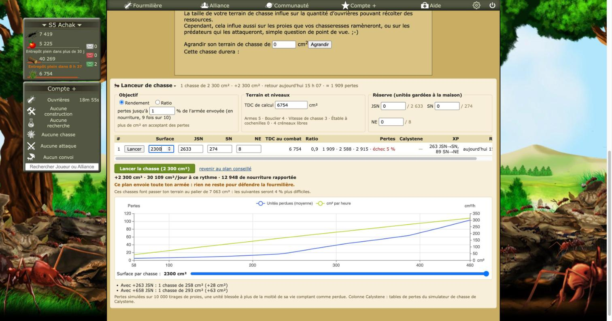
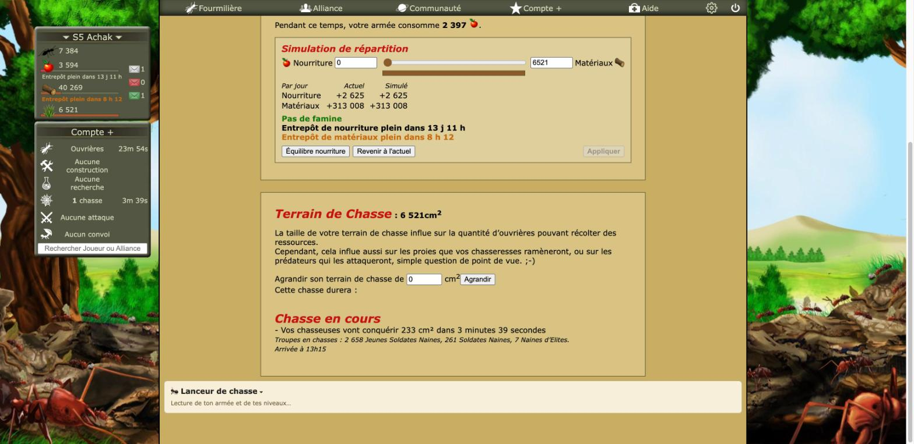
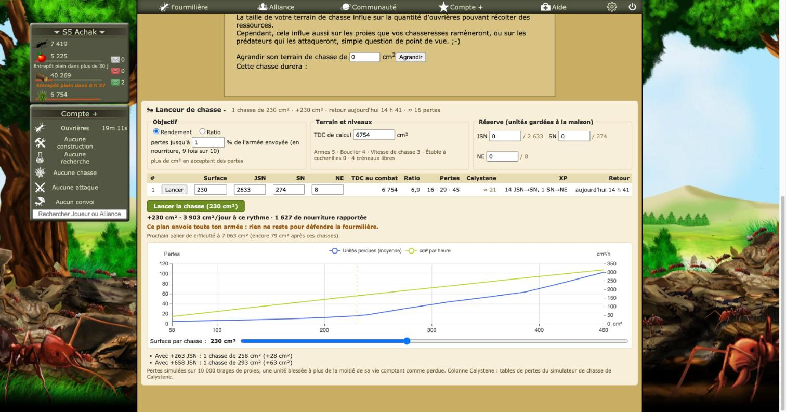
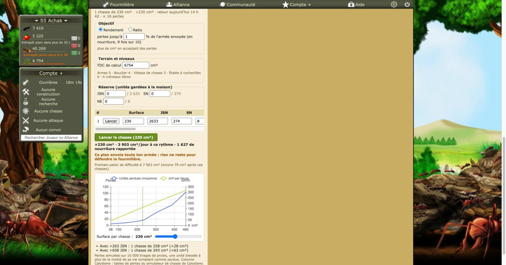

# Revue : Lanceur de chasse (`hunt-launcher`)

- Relecteur : sous-agent B
- Date : 2026-10-08
- Version : `package.json` 1.0.1, commit e228c3a
- Pages testées : `Ressources.php`, d'abord armée en chasse (rien à envoyer), puis armée rentrée (2 633 JSN, 274 SN, 8 NE ; TDC 6 754) ; Paramètres > Fonctionnalités
- Doc lue : `docs/features/hunt-launcher.md` (+ `docs/research/chasse.md`, `docs/research/fourmizzz-pages.md` « AcquerirTerrain.php »)

## Résumé

Le plan proposé est cohérent avec la recherche : 1 chasse de 230 cm², 16 · 29 · 45 pertes, ratio 6,9, retour à 14 h 41, durée (6 754 + 230) × 0,9³ s. L'encart est riche et l'état replié est bien mémorisé. Deux problèmes majeurs. En jeu, taper « 150 » dans la surface d'une chasse a donné **2 300 cm²** (≈ 1 909 pertes, 5 % d'échec), avec le bouton « Lancer » prêt à partir. Dans le code, après un lancement partiel, un réglage modifié remet tout à « Lancer ». En plus : l'encart reste bloqué sur « Lecture de ton armée… » quand l'armée est dehors, et la forme tutoie.

| Bloquant | Majeur | Mineur | Suggestion |
| -------- | ------ | ------ | ---------- |
| 0        | 2      | 8      | 4          |

## Constats

### hunt-launcher-01 · Taper « 150 » dans la surface donne une chasse de 2 300 cm²

- **Gravité** : majeur
- **Catégorie** : bug
- **Emplacement** : `src/features/hunt-launcher/HuntTable.tsx:88-111` ; `HuntLauncher.tsx:139-166` ; `Ressources.php`, tableau des chasses
- **Ce qui se passe** : les champs Surface et unités sont contrôlés par `plan.hunts[i]`, qui ne change qu'après la réponse du moteur (10 000 tirages). Entre deux frappes, React réaffiche l'ancienne valeur. En jeu, avec la valeur 230 sélectionnée puis « 150 » tapé, le champ a fini à **2300** : « 1 chasse de 2 300 cm² · ≈ 1 909 pertes », « échec 5 % », et le bouton vert « Lancer la chasse (2 300 cm²) » actif. Une faute de frappe invisible peut ainsi mener à lancer une chasse ruineuse.
- **Ce qui est attendu** : un état de saisie local, avec recalcul à la validation (Entrée, perte du focus) ou après une pause ; ne jamais réécrire un champ pendant qu'il a le focus.
- **Capture** : 
- **Touche aussi** : —

### hunt-launcher-02 · Après un lancement partiel, un réglage modifié propose de tout relancer

- **Gravité** : majeur
- **Catégorie** : bug
- **Emplacement** : `src/features/hunt-launcher/HuntLauncher.tsx:106-116`, `:168-181` ; `:86-96`
- **Ce qui se passe** : si une chasse échoue, la page n'est pas rechargée (`all.every(... "launched")`). `form` (armée disponible) et `ongoing` (créneaux) restent ceux d'avant le lancement. Toute modification ensuite (réserve, objectif, TDC de calcul) relance `plan` : `setStatuses([])` efface les « ✓ Lancée » et le bouton redevient « Lancer N chasses » avec l'armée et les créneaux d'avant. `launchOne` relit le formulaire et refuse s'il manque une unité, mais si l'armée suffit encore, des chasses en trop partent. (Lu dans le code ; non testable sans lancer.)
- **Ce qui est attendu** : après tout lancement, réussi ou non, relire `AcquerirTerrain.php` et les chasses en cours, ou recharger la page ; au minimum, garder les statuts tant que la page n'est pas relue.
- **Touche aussi** : —

### hunt-launcher-03 · Armée en chasse : l'encart reste sur « Lecture de ton armée… »

- **Gravité** : mineur
- **Catégorie** : bug
- **Emplacement** : `src/features/hunt-launcher/HuntLauncher.tsx:78`, `:205-212` ; `pages.ts:22-26` ; `Ressources.php`
- **Ce qui se passe** : pendant la chasse de 13 h 15, toute l'armée était dehors. `AcquerirTerrain.php` renvoie alors le formulaire sans `#tabChoixArmee` (« Vous n'avez pas d'armée a envoyer. ») ; `readHuntForm` renvoie `null`, donc `form` reste `null` et l'encart affiche « Lecture de ton armée et de tes niveaux… » sans fin. Pas de message, ni les « chasses en cours » ni la comparaison « attendre le retour », justement utile dans ce cas.
- **Ce qui est attendu** : distinguer « illisible » de « rien à envoyer », et afficher les chasses en cours avec l'heure de retour.
- **Capture** : 
- **Touche aussi** : —

### hunt-launcher-04 · Tutoiement, alors que le reste de l'extension vouvoie

- **Gravité** : mineur
- **Catégorie** : cohérence
- **Emplacement** : `src/features/hunt-launcher/view.ts:28` ; `HuntLauncher.tsx:209`, `:278`, `:325`, `:365`
- **Ce qui se passe** : en jeu : « Lecture de ton armée et de tes niveaux… », « Ce plan envoie toute ton armée », « Ces chasses font passer ton terrain au palier… ». Le catalogue, les rapports de chasse et le simulateur de combat disent « vous », et le jeu aussi (« Vos chasseuses… », « Vous n'avez pas d'armée »).
- **Ce qui est attendu** : le vouvoiement du jeu partout.
- **Touche aussi** : tdc-chain (`TdcChain.tsx:173`, `:516`), alliance-map (`AllianceMap.tsx:84`, `:125`), resource-forecast (`mount-costs.ts:32`)

### hunt-launcher-05 · Niveaux illisibles : plan calculé avec tout à 0, sans le dire

- **Gravité** : mineur
- **Catégorie** : bug
- **Emplacement** : `src/features/hunt-launcher/HuntLauncher.tsx:77`
- **Ce qui se passe** : si `loadLevels` échoue, Armes = Bouclier = Vitesse de chasse = 0 : un seul créneau, des pertes surestimées. Le plan s'affiche et peut se lancer ; seule la note « Armes 0 · Bouclier 0… » le trahit. (En jeu, niveaux lus correctement : Armes 5, Bouclier 4, Vitesse 3.)
- **Ce qui est attendu** : un avertissement visible (« niveaux inconnus : passez au Laboratoire »), et pas de bouton Lancer.
- **Touche aussi** : combat-simulator, game-levels

### hunt-launcher-06 · Curseur surface ↔ pertes : 2 s de calcul, le curseur revient en arrière

- **Gravité** : mineur
- **Catégorie** : code
- **Emplacement** : `src/features/hunt-launcher/engine/client.ts:16-48` ; `HuntLauncher.tsx:49`, `:128-137` ; `LossCurve.tsx:65-73`
- **Ce qui se passe** : en jeu, après un glissé de 230 à 377 cm², l'étiquette reste sur « 230 cm² » avec « Calcul… » pendant environ 2 s, et la poignée revient à sa place avant de sauter. Chaque cran envoie une requête que le worker traite en entier, dans l'ordre (`requestId` ne fait qu'ignorer les réponses périmées). Le worker n'est pas arrêté au démontage.
- **Ce qui est attendu** : poignée libre pendant le glissé, recalcul au relâchement, une seule requête en attente, `terminate()` dans `onRemove`.
- **Touche aussi** : —

### hunt-launcher-07 · Écarts entre la doc et le code

- **Gravité** : mineur
- **Catégorie** : doc
- **Emplacement** : `docs/features/hunt-launcher.md` (« Moteur », « Lancement ») ; `engine/planner.ts:54` ; `HuntLauncher.tsx:180`
- **Ce qui se passe** : la doc annonce « ~2 000 tirages de proies en recherche », le code en fait 1 000. Elle dit « rechargement de la page à la fin », mais le code ne recharge que si **toutes** les chasses sont parties (lien avec le constat 02). Elle ne dit rien du cas « aucune armée à envoyer » (03).
- **Ce qui est attendu** : aligner la doc.
- **Touche aussi** : —

### hunt-launcher-08 · Libellés et formats incohérents

- **Gravité** : mineur
- **Catégorie** : cohérence
- **Emplacement** : `HuntTable.tsx:51`, `:118-119` ; `LossCurve.tsx:64` ; `Ressources.php`
- **Ce qui se passe** : colonne « XP » pour les promotions (« Promues » dans les rapports de chasse) ; « Surface par chasse : 2300 cm² » sans espace des milliers, à côté de « 2 300 cm² » dans le résumé ; Pertes « 16 · 29 · 45 » dont le sens (moyenne · 9 fois sur 10 · pire) n'est que dans l'infobulle de l'en-tête.
- **Ce qui est attendu** : « Promues », nombres formatés partout, une légende visible des trois chiffres de pertes.
- **Capture** : 
- **Touche aussi** : hunt-reports

### hunt-launcher-09 · « pertes jusqu'à … % » : un champ vidé redevient aussitôt 1

- **Gravité** : mineur
- **Catégorie** : UX
- **Emplacement** : `src/features/hunt-launcher/HuntLauncher.tsx:245-253`
- **Ce qui se passe** : vérifié en jeu, effacer le champ pour taper une autre valeur le remet aussitôt à « 1 » (`Number("") / 100 || 0.01`) ; taper 0 donne aussi 1 %, pas le minimum de 0,1 %. Chaque frappe écrit le stockage et relance le plan.
- **Ce qui est attendu** : un état de saisie local, borné au minimum affiché.
- **Touche aussi** : —

### hunt-launcher-10 · Encart plus large que les encadrés du jeu ; graphe tassé en petite largeur

- **Gravité** : mineur
- **Catégorie** : UI
- **Emplacement** : `src/entrypoints/hunt-launcher.content/index.tsx:14-23` ; `src/features/hunt-launcher/style.css:6-16` ; `LossCurve.tsx:21-31` ; `Ressources.php`
- **Ce qui se passe** : l'encart est monté **après** `#boite_tdc` (728 px, centré) et prend toute la largeur de la colonne (environ 960 px). Il dépasse des deux côtés des encadrés « Récoltes » et « Terrain de Chasse », avec un fond crème `#f6efd9` qui ne ressemble à aucun encadré du jeu. Simulation à 400 px (largeur forcée sur `.hunt-launcher`, ce qui ne déclenche pas les media queries) : les fieldsets s'empilent bien, mais le tableau défile et cache Pertes, Calystene, XP et Retour, et la légende du graphe chevauche les titres d'axes (« Pertes », « cm²/h »).
- **Ce qui est attendu** : la largeur et le style des encadrés du jeu (dans `#boite_tdc` ou à sa largeur) ; légende du graphe sous les axes en petite largeur.
- **Capture** :  
- **Touche aussi** : —

### hunt-launcher-11 · Courbe et conseil de ponte restent ceux du plan conseillé

- **Gravité** : suggestion
- **Catégorie** : UX
- **Emplacement** : `HuntLauncher.tsx:369-382` ; `engine/requests.ts:27-40`
- **Ce qui se passe** : après une modification (surface à 2 300), la courbe va toujours de 58 à 460 cm² avec le repère hors de l'échelle, et « Avec +263 JSN : … (+28 cm²) » compare toujours au plan conseillé. Avec des surfaces inégales, la courbe ne rejoue que des chasses égales calées sur la première.
- **Ce qui est attendu** : dire à quoi se rapportent courbe et conseils (« plan conseillé, surfaces égales »), ou les masquer quand le plan est modifié.
- **Touche aussi** : —

### hunt-launcher-12 · Emoji, palette en dur, graphe aux couleurs d'ECharts

- **Gravité** : suggestion
- **Catégorie** : UI
- **Emplacement** : `src/features/hunt-launcher/style.css` ; `HuntLauncher.tsx:191` ; `HuntTable.tsx:19-24` ; `LossCurve.tsx:21-56`
- **Ce qui se passe** : titre « 🐜 Lanceur de chasse », statuts « ✓ / ✗ » ; une vingtaine de couleurs en dur, proches mais différentes de celles du simulateur ; le graphe garde le bleu / vert d'ECharts et un curseur `range` bleu natif ; bouton vert `#6b8e23` sans équivalent dans le jeu.
- **Ce qui est attendu** : des tokens communs, dont un thème ECharts partagé avec history et alliance-map.
- **Touche aussi** : combat-simulator, history, alliance-map, tdc-chain

### hunt-launcher-13 · Le plan conseillé envoie toute l'armée

- **Gravité** : suggestion
- **Catégorie** : UX
- **Emplacement** : `HuntLauncher.tsx:216-217`, `:364-366` ; Réserve
- **Ce qui se passe** : avec une réserve à 0 (par défaut), le plan conseillé envoie les 2 633 JSN, 274 SN et 8 NE, et prévient « rien ne reste pour défendre la fourmilière ». L'avertissement est clair, mais le défaut pousse à vider la garnison.
- **Ce qui est attendu** : à trancher avec le joueur, par exemple une réserve par défaut ou un rappel dans le bouton Lancer.
- **Touche aussi** : —

### hunt-launcher-14 · La vue n'a aucun test

- **Gravité** : suggestion
- **Catégorie** : code
- **Emplacement** : `HuntLauncher.tsx`, `HuntTable.tsx` ; `__fixtures__/hunt-form.html`
- **Ce qui se passe** : la doc l'assume (« la vue se vérifie dans le jeu »), mais la logique de statuts et de relance (02), de saisie (01) et le cas sans armée (03, absent des fixtures) vivent dans le composant.
- **Ce qui est attendu** : sortir cette logique en fonctions pures testées, et ajouter une fixture « Vous n'avez pas d'armée a envoyer ».
- **Touche aussi** : —

## Questions ouvertes

### Q1 · « Chasse si longue ? » et détection du succès

- **Observation** : le succès se lit au texte « La chasse est lanc » (`launch.ts:20`). La confirmation « chasse si longue » (`validation_chasse_longue`) n'est pas gérée ; la recherche dit que le POST direct l'évite, sans preuve.
- **Hypothèses** : 1) le POST direct n'est jamais interrompu ; 2) une très longue chasse renvoie la page de confirmation, d'où « ✗ Refusée » alors que rien n'est parti.
- **Comment trancher** : lire la réponse d'un lancement réel fait par le joueur (pas par la revue).

### Q2 · Tables de Calystene recopiées

- **Observation** : `engine/calystene.ts` reprend les coefficients du simulateur de Calystene (sans licence), en citant la source.
- **Hypothèses** : 1) ce sont des données de mesure, pas du code : acceptable ; 2) il faut l'accord de l'auteur.
- **Comment trancher** : décision du joueur (même logique que la règle Toolzzz du `CLAUDE.md`).

## Préparation au mode « moderne »

- **Facilite** : Shadow DOM (`createShadowRootUi`, `:host { all: initial }`), une seule feuille `style.css`, composants séparés (table, courbe).
- **Bloque** : couleurs en dur sans variables ; palette recopiée, avec de petits écarts, de celle du simulateur ; ECharts non thématisé ; emoji et glyphes dans les libellés.

## Hors périmètre / non testé

- **Lancement de chasses** (« Lancer », « Lancer la chasse », « Réessayer ») : jamais cliqué. Les constats 02 et Q1 viennent du code.
- « Attendre le retour » : non affiché (pas de chasse en cours pendant le test avec l'armée rentrée).
- Réglages : relevés avant de toucher à quoi que ce soit (Rendement, 1 %, réserve 0 / 0 / 0, encart ouvert), puis vérifiés identiques après rechargement. Surface modifiée remise par « revenir au plan conseillé » (état non mémorisé). Largeur forcée retirée.
- `resize_window` sans effet (fenêtre restée à 1 728 px CSS) ; seule la simulation par largeur forcée a servi (constat 10).
- Désactivation : plus d'encart après rechargement ; feature réactivée.
- Console : aucune erreur Optizzz, worker accepté par la page.
