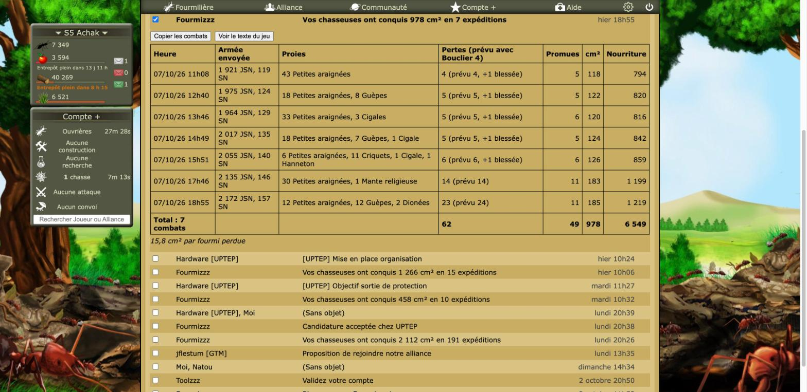
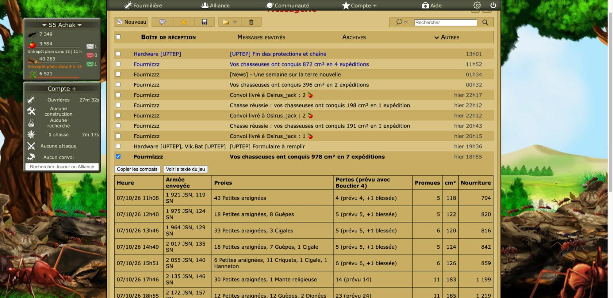
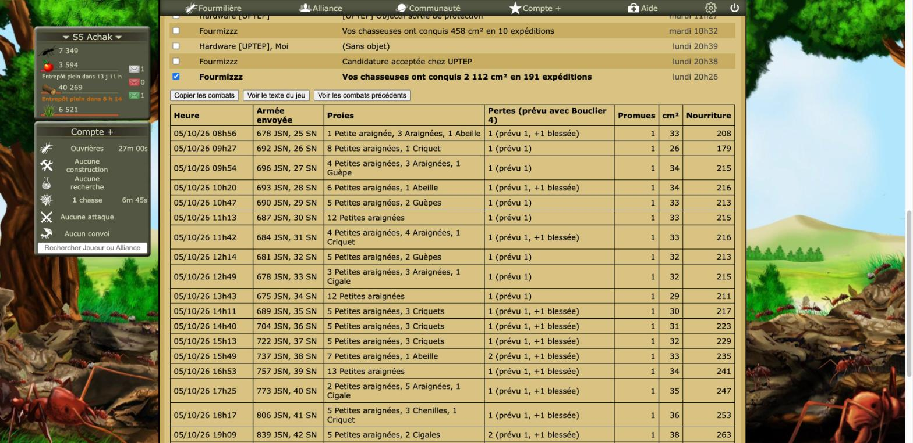

# Revue : Rapports de chasse (`hunt-reports`)

- Relecteur : sous-agent B
- Date : 2026-10-08
- Version : `package.json` 1.0.1, commit e228c3a
- Pages testées : `messagerie.php` (conversations « 978 cm² en 7 expéditions » et « 2 112 cm² en 191 expéditions », « Voir les combats précédents », « Copier », texte du jeu), Paramètres > Fonctionnalités
- Doc lue : `docs/features/hunt-reports.md` (+ `docs/research/chasse.md`, `docs/research/fourmizzz-pages.md` « messagerie.php »)

## Résumé

La feature marche bien en jeu : le tableau apparaît à l'ouverture d'une conversation « Chasses », la prévision tombe juste (« 23 (prévu 24) », « 5 (prévu 5, +1 blessée) »), « Voir les combats précédents » passe de 10 à 20 combats et met le total à jour, et « Copier » fonctionne. Les défauts sont mineurs : un rendement « cm² par fourmi perdue » qui oublie les blessées annoncées, des abréviations d'unités qui coupent les cellules, et le texte replié qui cache aussi le bouton « Corbeille » du jeu.

| Bloquant | Majeur | Mineur | Suggestion |
| -------- | ------ | ------ | ---------- |
| 0        | 0      | 5      | 5          |

## Constats

### hunt-reports-01 · « cm² par fourmi perdue » ne compte pas les blessées annoncées perdues

- **Gravité** : mineur
- **Catégorie** : cohérence
- **Emplacement** : `src/features/hunt-reports/report.ts:125-132` ; `src/features/hunt-reports/mount.ts:150-153` ; `messagerie.php`, conversation « 978 cm² en 7 expéditions »
- **Ce qui se passe** : la colonne Pertes annonce 5 blessées perdues sur 7 combats (« 4 (prévu 4, +1 blessée) »…), la doc les dit « perdues, absentes du rapport ». Pourtant le total (62) et « 15,8 cm² par fourmi perdue » (978 / 62) ne comptent que les tuées du rapport. Le Lanceur de chasse, lui, compte les blessées comme perdues : deux définitions de « perte ».
- **Ce qui est attendu** : soit ajouter les blessées prévues (« 62 tuées + 5 blessées prévues », 14,6 cm² par fourmi), soit renommer en « cm² par fourmi tuée ».
- **Capture** : 
- **Touche aussi** : hunt-launcher

### hunt-reports-02 · Armée en abréviations maison, qui coupent la cellule

- **Gravité** : mineur
- **Catégorie** : cohérence
- **Emplacement** : `src/features/hunt-reports/mount.ts:26-34`, `:18` ; `messagerie.php`
- **Ce qui se passe** : « 1 921 JSN, 119 SN » à côté de « 43 Petites araignées ». La colonne « Armée envoyée » est étroite et coupe la ligne au milieu (« 1 921 JSN, 119 » / « SN »). Les clés sont celles d'Optizzz (`Tu`, `TuE`, `Tk`…), alors que `Armee.php` écrit T / TE pour les Tueuses. Aucune infobulle ne donne le nom complet.
- **Ce qui est attendu** : un seul jeu d'abréviations dans toute l'extension, aligné sur le jeu, avec le nom complet en `title`, et `white-space: nowrap` entre un nombre et son unité.
- **Capture** : 
- **Touche aussi** : hunt-launcher, flood, targets (toute vue qui affiche `unit.key`)

### hunt-reports-03 · Le texte replié cache aussi le bouton « Corbeille » du jeu

- **Gravité** : mineur
- **Catégorie** : UX
- **Emplacement** : `src/features/hunt-reports/mount.ts:104-106` ; `messagerie.php`, conversation ouverte
- **Ce qui se passe** : le tableau du jeu replié par défaut contient, en plus du texte des combats et du lien « Voir les messages précédents » (remplacé par un bouton), le bouton « Corbeille » de la conversation. Il n'est plus visible tant qu'on ne clique pas sur « Voir le texte du jeu ».
- **Ce qui est attendu** : laisser visibles les contrôles du jeu (Corbeille), ou proposer l'équivalent dans la barre d'outils d'Optizzz.
- **Touche aussi** : —

### hunt-reports-04 · Unités ou proies inconnues ignorées en silence dans la prévision

- **Gravité** : mineur
- **Catégorie** : code
- **Emplacement** : `src/features/hunt-reports/report.ts:53` et `:79`
- **Ce qui se passe** : une unité non reconnue garde son nom comme clé et `armyFromKeys` l'ignore ; une proie dont le nom ne correspond pas à `plural` ou `name` compte pour 0. La prévision est alors fausse sans signal, et la ligne peut être colorée « loin du prévu » à tort. Non rencontré en jeu : les 27 combats lus étaient tous reconnus, y compris « 1 Petite araignée » au singulier.
- **Ce qui est attendu** : pas de prévision (ou « ? ») quand une entrée n'est pas reconnue, et un test qui le couvre.
- **Touche aussi** : —

### hunt-reports-05 · En-têtes : « Heure » pour une date, « Promues » ici, « XP » dans le lanceur

- **Gravité** : mineur
- **Catégorie** : cohérence
- **Emplacement** : `src/features/hunt-reports/mount.ts:73-74` ; `src/features/hunt-launcher/HuntTable.tsx:51`
- **Ce qui se passe** : la colonne « Heure » contient « 07/10/26 11h08 » ; les promotions s'appellent « Promues » ici et « XP » dans le Lanceur de chasse.
- **Ce qui est attendu** : « Date » (ou « Combat »), et un seul mot pour les promotions.
- **Touche aussi** : hunt-launcher

### hunt-reports-06 · « Total : 20 combats » pour une conversation de 191 expéditions

- **Gravité** : suggestion
- **Catégorie** : UX
- **Emplacement** : `src/features/hunt-reports/mount.ts:96-101`, `:137` ; `messagerie.php`, conversation « 191 expéditions »
- **Ce qui se passe** : le jeu charge 10 combats à la fois. « Voir les combats précédents » marche (10 → 20, total recalculé), mais il faudrait 19 clics pour tout voir. Le total « 20 combats » peut se lire comme celui de la conversation.
- **Ce qui est attendu** : « 20 combats affichés sur 191 », et peut-être un « Tout charger » (clics successifs sur le lien du jeu, avec une pause).
- **Capture** : 
- **Touche aussi** : —

### hunt-reports-07 · « Copié ! » ne revient jamais à « Copier les combats »

- **Gravité** : suggestion
- **Catégorie** : UX
- **Emplacement** : `src/features/hunt-reports/mount.ts:84-88`
- **Ce qui se passe** : vu en jeu, le bouton reste « Copié ! », même après « Voir les combats précédents » qui change ce qu'il y a à copier.
- **Ce qui est attendu** : revenir au libellé initial après quelques secondes ou à chaque `update()`.
- **Touche aussi** : —

### hunt-reports-08 · Boutons natifs, styles en dur

- **Gravité** : suggestion
- **Catégorie** : UI
- **Emplacement** : `src/features/hunt-reports/mount.ts:14-22` ; `messagerie.php`
- **Ce qui se passe** : le tableau s'intègre plutôt bien (bordures noires, police Verdana du jeu, fond de la page). Les trois boutons sont en revanche des boutons natifs (police Arial, gris), sans rapport avec les pictos de la messagerie. Couleurs `#000` et `rgba(200, 0, 0, 0.15)` en dur dans une `<style>` globale.
- **Ce qui est attendu** : tokens communs (bordure de tableau, fond d'alerte, bouton) partagés avec les autres features.
- **Touche aussi** : laying-planner, combat-simulator, hunt-launcher

### hunt-reports-09 · Le `MutationObserver` rescanne toute la messagerie à chaque mutation

- **Gravité** : suggestion
- **Catégorie** : code
- **Emplacement** : `src/features/hunt-reports/index.ts:38-62`
- **Ce qui se passe** : `childList + subtree` sur `body` ; chaque mutation (y compris celles de la feature dans `update()`) relance `querySelectorAll("tr.contenu_conversation")` et `headerOf`. Pas de boucle ni de lenteur visible en jeu, mais c'est coûteux sur une longue messagerie.
- **Ce qui est attendu** : ignorer les mutations sous `.optizzz-hunt-report`, ou n'observer que le tableau des conversations.
- **Touche aussi** : —

### hunt-reports-10 · Trous dans les tests

- **Gravité** : suggestion
- **Catégorie** : code
- **Emplacement** : `src/features/hunt-reports/index.ts` ; `report.test.ts`
- **Ce qui se passe** : pas de test de `index.ts` (filtre `data-type="Chasses"`, montage unique, mise à jour après « messages précédents ») ; pas de fixture de chasse **perdue** ; la fixture ne contient pas le bouton « Corbeille » (constat 03).
- **Ce qui est attendu** : un rapport de défaite dans les fixtures et un test du repérage des conversations.
- **Touche aussi** : —

## Questions ouvertes

### Q1 · Les blessées « perdues » existent-elles ?

- **Observation** : la colonne Pertes ajoute « +1 blessée » d'après la règle de la demi-vie, non vérifiable dans les rapports (`docs/research/chasse.md`, « À vérifier »). En jeu : 2 658 JSN en chasse à 13 h 15, 2 633 JSN au retour sur `Ressources.php` et `Armee.php`, alors que le combat correspondant n'est pas encore relevé.
- **Hypothèses** : 1) la règle est vraie, et le total devrait compter les blessées (constat 01) ; 2) elle est fausse, et il faudrait retirer la mention.
- **Comment trancher** : comparer, pour une même chasse, l'armée envoyée, l'armée revenue (`Armee.php`) et le rapport de ce combat, sans ponte entre les deux.

### Q2 · Niveaux actuels pour des combats anciens

- **Observation** : Bouclier et Étable à cochenilles sont ceux d'aujourd'hui (la doc le dit) ; l'en-tête ne nomme que le Bouclier. Les combats du 05/10 sont rejoués avec Bouclier 4 et tombent juste quand même.
- **Hypothèses** : 1) acceptable, documenté ; 2) il faudrait signaler les combats antérieurs à la dernière montée de Bouclier.
- **Comment trancher** : avis du joueur.

## Préparation au mode « moderne »

- **Facilite** : classes préfixées `optizzz-hunt-report-*`, tableau construit en un seul endroit.
- **Bloque** : couleurs en dur (`mount.ts:18`, `:21`), styles globaux, boutons natifs, aucune variable partagée.

## Hors périmètre / non testé

- Seuls des GET : ouvrir des conversations **déjà lues** et charger les messages précédents (le clic coche la case de la ligne côté jeu, sans effet tant qu'on n'utilise pas les actions groupées ; la page a ensuite été rechargée).
- Ligne « loin du prévu » : aucun combat réel ne dépassait le seuil, donc rendu non vu en jeu (couvert par `mount.test.ts`).
- Console : `TypeError: Cannot read properties of undefined (reading 'top')` (`messagerie.php:2460`) à l'ouverture et au chargement des messages précédents. L'erreur se reproduit **feature coupée** : elle vient du jeu, pas d'Optizzz.
- Petites largeurs : le jeu a une mise en page fixe (`#centre` à 1 093 px), et `resize_window` est resté sans effet. Pas de test pertinent possible.
- Désactivation : plus de tableau après rechargement ; feature réactivée.
