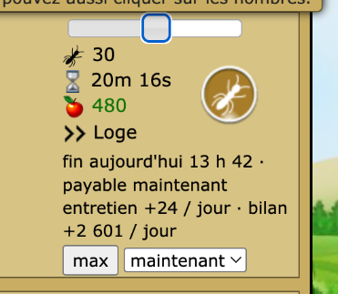
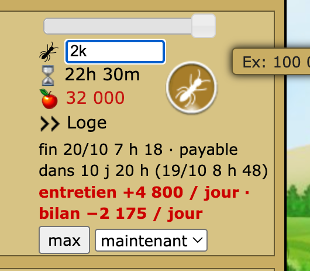
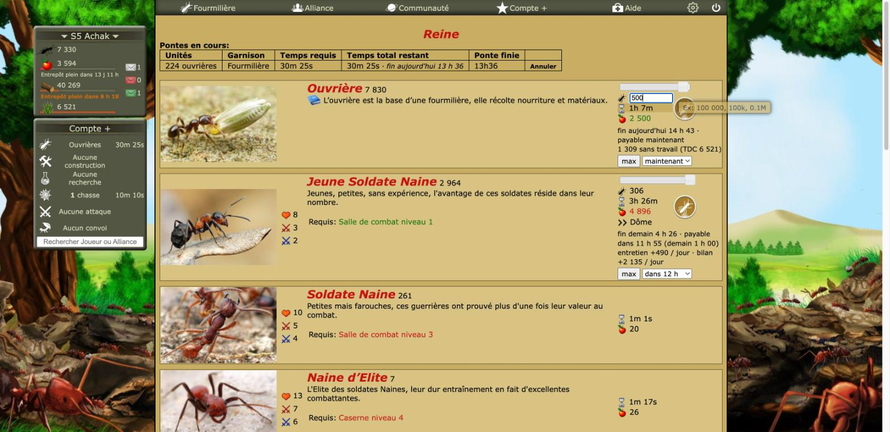
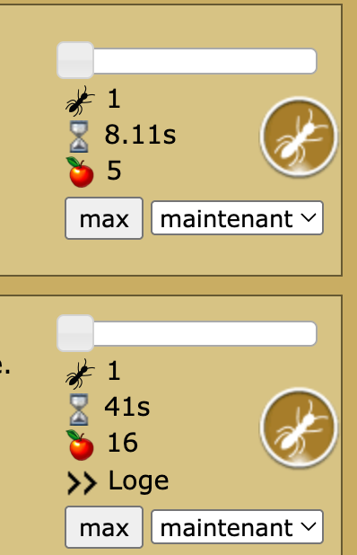

# Revue : Planificateur de ponte (`laying-planner`)

- Relecteur : sous-agent B
- Date : 2026-10-08
- Version : `package.json` 1.0.1, commit e228c3a
- Pages testées : `Reine.php` (s5, file de ponte de 224 ouvrières en cours, 3 594 nourriture), Paramètres > Fonctionnalités (désactivation / réactivation)
- Doc lue : `docs/features/laying-planner.md` (+ `docs/research/fourmizzz-pages.md` « Reine.php »)

## Résumé

Les calculs sont justes là où on peut les vérifier en jeu : 2 000 JSN coûtent 32 000 de nourriture, d'où un entretien de 4 800 par jour en Loge ; « max » donne 224 JSN pour 3 594 de nourriture. « max » ne fait que remplir le champ, sans rien lancer. Problème principal : le jeu règle maintenant la ponte avec un **curseur**, que la feature n'écoute pas, si bien que les lignes affichées gardent l'ancien nombre jusqu'au recalcul de la minute. Le reste est mineur : état figé au chargement, signe de l'entretien, ouvrières de la file oubliées.

| Bloquant | Majeur | Mineur | Suggestion |
| -------- | ------ | ------ | ---------- |
| 0        | 1      | 4      | 3          |

## Constats

### laying-planner-01 · Le curseur de ponte du jeu ne met pas les lignes à jour

- **Gravité** : majeur
- **Catégorie** : bug
- **Emplacement** : `src/features/laying-planner/mount.ts:107-110` ; `Reine.php`, cellule de coût de la Jeune Soldate Naine
- **Ce qui se passe** : sur `Reine.php`, le nombre se règle d'abord avec un curseur jQuery UI (`#slider1`). Le champ `input_cout_nombreN` est masqué (`display: none`) et n'apparaît qu'en cliquant sur le nombre (« Changer la Quantité »). Les champs « Changer la Durée » (`input_cout_tempsN`) et « Changer le Coût » (`input_cout_nourritureN`) modifient aussi le nombre. La feature n'écoute que `keyup` / `input` / `change` sur `input_cout_nombreN` et le clic sur la destination. Déplacer le curseur change `nombre_de_ponte1` et le coût du jeu (30 JSN, 480 de nourriture), mais Optizzz affiche encore l'entretien de 10 JSN (« entretien +24 / jour »), jusqu'au `setInterval` de 60 s. Le curseur garde aussi l'ancienne position quand « max » remplit le champ.
- **Ce qui est attendu** : suivre les changements de `nombre_de_ponteN` / `cout_nourritureN`, par exemple avec un `MutationObserver` sur les spans de coût ou un écouteur sur les événements du curseur, et ceux des deux autres champs.
- **Capture** : 
- **Touche aussi** : —

### laying-planner-02 · « entretien +4 800 / jour » : un coût écrit avec un plus, toute la ligne en rouge

- **Gravité** : mineur
- **Catégorie** : cohérence
- **Emplacement** : `src/features/laying-planner/mount.ts:102-104` ; `Reine.php`
- **Ce qui se passe** : l'entretien est une dépense mais s'écrit « +4 800 / jour », juste à côté de « bilan −2 175 / jour ». Quand le bilan devient négatif, **toute** la ligne passe en rouge gras, entretien compris, alors que seul le bilan est en cause.
- **Ce qui est attendu** : « entretien −4 800 / jour » ou sans signe, et le rouge sur le bilan seulement.
- **Capture** : 
- **Touche aussi** : —

### laying-planner-03 · Les ouvrières déjà en ponte ne comptent pas dans « sans travail »

- **Gravité** : mineur
- **Catégorie** : bug
- **Emplacement** : `src/features/laying-planner/laying.ts:95` ; `Reine.php`, ligne Ouvrière
- **Ce qui se passe** : 7 330 ouvrières + 500 tapées − 6 521 cm² → « 1 309 sans travail (TDC 6 521) ». Les 224 ouvrières de la file « Pontes en cours » (affichée juste au-dessus) ne sont pas comptées : il y en aura en fait 1 533 sans travail.
- **Ce qui est attendu** : ajouter les ouvrières de la file (première case du tableau « Pontes en cours »).
- **Capture** : 
- **Touche aussi** : —

### laying-planner-04 · Le recalcul toutes les minutes repart du stock lu au chargement

- **Gravité** : mineur
- **Catégorie** : bug
- **Emplacement** : `src/features/laying-planner/index.ts:25` et `:37-39` ; `src/features/resource-forecast/forecast.ts:52-58`
- **Ce qui se passe** : `state` (stock de l'en-tête, revenus) est figé au chargement. Le `setInterval` de 60 s rappelle `render()` avec un `now` qui avance, mais `segments()` suppose que « le stock est actuel » (commentaire l. 52-53) : les récoltes passées depuis le chargement sont sautées et jamais ajoutées. Avec la page ouverte depuis une heure, il manque deux récoltes, et « payable dans … » comme « max » sous-estiment.
- **Ce qui est attendu** : calculer avec l'heure de lecture et ne rafraîchir que l'affichage relatif, ou projeter le stock jusqu'à `now`.
- **Touche aussi** : resource-forecast (même hypothèse dans toute vue qui se recalcule sur une page restée ouverte)

### laying-planner-05 · Rien ne s'affiche, sans explication, si les revenus sont illisibles

- **Gravité** : mineur
- **Catégorie** : UX
- **Emplacement** : `src/features/laying-planner/index.ts:21-24` ; `src/features/resource-forecast/income.ts:51-68`
- **Ce qui se passe** : sans cache récent et si `Ressources.php` ne se lit pas, `loadIncome` lève une erreur (logée en console) ; s'il renvoie `null`, la feature sort en silence. Dans les deux cas, ni lignes ni bouton « max ». Non reproduit en jeu (revenus lisibles).
- **Ce qui est attendu** : garder au moins « max » sur le stock actuel, ou une ligne « Passez sur Ressources pour les prévisions ».
- **Touche aussi** : resource-forecast

### laying-planner-06 · Contrôles natifs et police différente de celle du jeu

- **Gravité** : suggestion
- **Catégorie** : UI
- **Emplacement** : `src/features/laying-planner/mount.ts:6-10` ; `Reine.php`
- **Ce qui se passe** : le bouton « max » et la liste « maintenant / dans 1 h… » ont l'aspect natif du navigateur (gris, coins arrondis), à côté des pictos ronds dorés du jeu. Le texte ajouté (0,9 em) passe sur 3 ou 4 lignes dans une colonne étroite. `#c00` est codé en dur dans une `<style>` globale.
- **Ce qui est attendu** : un style de bouton façon jeu, et des variables CSS partagées (couleur « négatif »).
- **Capture** : 
- **Touche aussi** : hunt-reports, combat-simulator, toutes les features légères

### laying-planner-07 · « max » sur les ouvrières ignore le TDC

- **Gravité** : suggestion
- **Catégorie** : UX
- **Emplacement** : `src/features/laying-planner/mount.ts:66-73`
- **Ce qui se passe** : pour les ouvrières, « max » remplit le champ avec tout ce que la nourriture paie. On voit déjà 1 309 ouvrières « sans travail » pour 500 tapées : « max » en ajouterait d'autres, inutiles.
- **Ce qui est attendu** : un « max utile » (jusqu'au TDC) ou un plafond, à trancher avec le joueur.
- **Touche aussi** : —

### laying-planner-08 · `index.ts` (file d'attente, recalcul) sans test

- **Gravité** : suggestion
- **Catégorie** : code
- **Emplacement** : `src/features/laying-planner/index.ts` ; `__fixtures__/reine-form.html`
- **Ce qui se passe** : ni la fin de file ni le rafraîchissement ne sont testés, et la fixture `Reine.php` ne contient pas le curseur actuel du jeu (constat 01).
- **Ce qui est attendu** : relever une fixture `Reine.php` à jour (curseur, champs durée / coût), un test avec une file non vide et un test « une heure plus tard ».
- **Touche aussi** : —

## Questions ouvertes

### Q1 · Base de l'entretien

- **Observation** : l'entretien vaut 5 / 10 / 15 % de la nourriture **affichée** par le jeu pour la ponte (`laying.ts:89`). Vérifié en jeu : 32 000 × 15 % = 4 800.
- **Hypothèses** : 1) l'entretien se calcule sur le coût affiché ; 2) il se calcule sur le coût de base de l'unité, si les deux diffèrent un jour (bonus).
- **Comment trancher** : comparer la consommation de l'armée sur `Ressources.php` (« votre armée consomme 2 397 ») avant et après une ponte connue.

### Q2 · Une ouvrière par cm²

- **Observation** : la ligne compte une ouvrière par cm² ; `Ressources.php` le confirme (« Vous ne pouvez avoir plus d'une ouvrière par cm² », 6 521 ouvrières sur 6 521 cm²).
- **Hypothèses** : 1) les ouvrières parties en convoi comptent aussi ; 2) non.
- **Comment trancher** : `Ressources.php` pendant un convoi.

## Préparation au mode « moderne »

- **Facilite** : tout le texte passe par trois classes (`optizzz-laying-*`) ; logique séparée du rendu.
- **Bloque** : `#c00` codé en dur (`mount.ts:8`), styles dans une chaîne propre à la feature, pas de tokens communs ; bouton et liste natifs.

## Hors périmètre / non testé

- « Pondre » jamais cliqué. Les champs remplis (2k, 500, max) ont été abandonnés par un rechargement de la page.
- Petites largeurs : `resize_window` sans effet (la fenêtre reste à 1 728 px). Une simulation avec `document.body.style.width = '800px'` (qui ne déclenche pas les media queries) écrase la colonne centrale du jeu à 180 px : le jeu a une mise en page fixe (`#centre` à 1 093 px), donc le test ne dit rien de la feature. Style annulé ensuite.
- Désactivation : sans effet sur la page ouverte, effective après rechargement (plus aucun `.optizzz-laying`) ; feature réactivée.
- Console : aucune erreur Optizzz.
