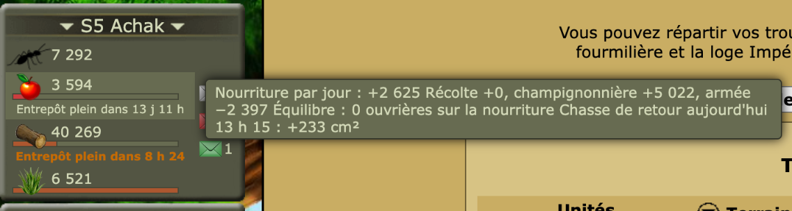
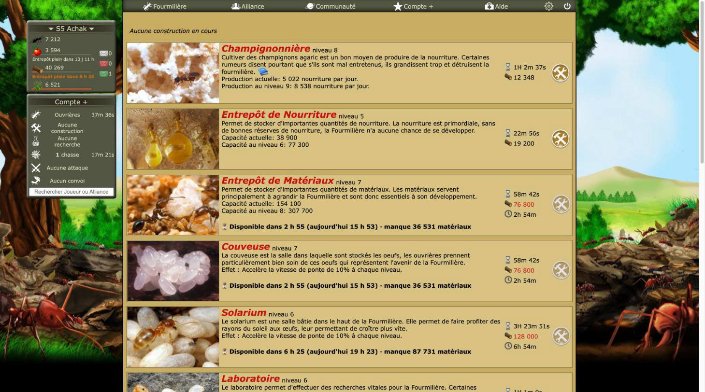
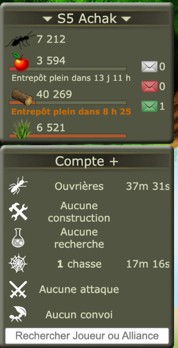

# Revue : Prévisions de ressources (`resource-forecast`)

- Relecteur : sous-agent A
- Date : 2026-10-08
- Version : `package.json` 1.0.1, commit e228c3a, build `chrome-mv3-dev` chargé dans Chrome
- Pages testées : construction.php, laboratoire.php, Ressources.php, Reine.php, Armee.php (S5, compte avec Compte+) ; options « Famine et entrepôt plein dans l'en-tête » coupée puis rétablie
- Doc lue : `docs/features/resource-forecast.md` (+ `docs/research/ressources-et-entretien.md`, `docs/research/fourmizzz-pages.md`)

## Résumé

Le moteur (`forecast.ts`, par segments entre récoltes et retours de chasse) est clair, documenté et bien testé ; c'est la feature la plus riche de la zone. En jeu, les chiffres concordent avec ceux du jeu (manques, solde +2 625/j = 5 022 − 2 397) et le simulateur s'intègre bien sous le résumé des récoltes. Deux défauts visibles : l'infobulle de l'en-tête est aplatie par celle du jeu, et le délai double celui que Compte+ affiche déjà. Les autres défauts sont de cohérence (seuils et couleurs d'urgence qui changent d'un endroit à l'autre, tutoiement isolé, doc des libellés en retard) et de structure : le moteur sert aussi aux Alertes mais reste rangé dans la feature au lieu de `src/game/`.

| Bloquant | Majeur | Mineur | Suggestion |
| -------- | ------ | ------ | ---------- |
| 0        | 0      | 8      | 3          |

## Constats

### resource-forecast-01 · Infobulle de l'en-tête illisible : le jeu écrase ses retours à la ligne

- **Gravité** : mineur
- **Catégorie** : bug
- **Emplacement** : en-tête, ligne sous la jauge de nourriture (toutes les pages) ; `src/features/resource-forecast/mount-outlook.ts:17, 25, 76`
- **Ce qui se passe** : la ligne est ajoutée dans `td.tooltip_boite_info`, cellule gérée par l'infobulle du jeu. Le jeu reprend notre attribut `title` dans sa propre infobulle, qui ignore les `\n` : le détail (solde, récolte, champignonnière, armée, équilibre, retour de chasse) s'affiche en un seul paragraphe tassé, « Nourriture par jour : +2 625 Récolte +0, champignonnière +5 022, armée −2 397 Équilibre : 0 ouvrières… ».
- **Ce qui est attendu** : une infobulle à nous (ou du HTML avec ` ` si l'infobulle du jeu l'accepte), lisible ligne par ligne.
- **Capture** : 
- **Touche aussi** : —

### resource-forecast-02 · Délai en double avec la ligne Compte+ du jeu, à une minute près

- **Gravité** : mineur
- **Catégorie** : cohérence
- **Emplacement** : construction.php (Entrepôt de Matériaux, Couveuse, Solarium…) ; `src/features/resource-forecast/mount-costs.ts:50` ; `src/utils/time-format.ts:9`
- **Ce qui se passe** : avec Compte+, le jeu affiche déjà le temps avant de pouvoir payer (icône horloge, « 2h 54m »). Optizzz ajoute dessous « ⏳ Disponible dans 2 h 55 (aujourd'hui 15 h 53) · manque 36 531 matériaux » : même information, en gras, et avec une minute d'écart (le jeu tronque, `formatDuration` arrondit à la minute supérieure). Le joueur voit deux chiffres différents pour la même chose. L'apport réel d'Optizzz ici, c'est l'heure et le manque.
- **Ce qui est attendu** : avec Compte+, n'afficher que ce que le jeu ne donne pas (heure, ressource manquante, file pleine), ou s'aligner sur l'arrondi du jeu ; ligne moins appuyée (le gras attire plus l'œil que les coûts eux-mêmes).
- **Capture** : 
- **Touche aussi** : —

### resource-forecast-03 · Seuils et couleurs d'urgence différents selon l'endroit

- **Gravité** : mineur
- **Catégorie** : cohérence
- **Emplacement** : `src/features/resource-forecast/mount-outlook.ts:37-38` ; `src/features/resource-forecast/mount-simulator.ts:181-189` ; `src/features/alerts/badge.ts:9-10`
- **Ce qui se passe** : dans l'en-tête, « Entrepôt plein dans 3 h » est rouge (< 6 h) ; dans le simulateur, la même ligne n'est jamais rouge (seule la famine a droit au rouge, l'entrepôt plafonne à l'orange). Le badge des Alertes utilise d'autres seuils : rouge sous 2 h, orange sous 12 h, contre 6 h / 24 h dans l'en-tête. Les couleurs elles-mêmes diffèrent (`#c76b00` / `#c00` ici, `#e07000` / `#c00000` pour le badge).
- **Ce qui est attendu** : une seule échelle d'urgence (seuils + couleurs) partagée, ou une différence assumée et écrite dans la doc.
- **Capture** :  (en-tête : « Entrepôt plein dans 8 h 25 » en orange ; le même délai serait rouge sous 6 h, alors que le simulateur le laisserait orange)
- **Touche aussi** : alerts

### resource-forecast-04 · Tutoiement dans l'infobulle des délais

- **Gravité** : mineur
- **Catégorie** : cohérence
- **Emplacement** : `src/features/resource-forecast/mount-costs.ts:32` (« estimation d'après tes récoltes, ta champignonnière et ton armée »)
- **Ce qui se passe** : le reste de la feature et le catalogue vouvoient (« Quand vous pourrez payer »). Le tutoiement se retrouve aussi dans `hunt-launcher` et `tdc-chain`, le vouvoiement dans les Alertes et les paramètres.
- **Ce qui est attendu** : un seul registre pour toute l'extension (à décider), noté dans `CLAUDE.md`.
- **Capture** : —
- **Touche aussi** : hunt-launcher, tdc-chain, alerts, settings

### resource-forecast-05 · Libellés de la doc différents du code

- **Gravité** : mineur
- **Catégorie** : doc
- **Emplacement** : `docs/features/resource-forecast.md` (§ 1 « File d'attente », § « Format ») ; `src/features/resource-forecast/mount-costs.ts:50-51`
- **Ce qui se passe** : la doc annonce « file pleine jusqu'à 14 h 16 » et « vers 18 h 40 » ; le code écrit « Disponible dans 3 h 12 (aujourd'hui 18 h 40) · file pleine » et jamais « vers ». La doc dit « il manque N ouvrières », le code « Il manque N ouvrières » (majuscule, sans conséquence).
- **Ce qui est attendu** : aligner la doc (ou le code) ; trancher « vers » ou non.
- **Capture** : —
- **Touche aussi** : —

### resource-forecast-06 · Entrepôts jamais lus : aucune alerte de remplissage, sans le dire

- **Gravité** : mineur
- **Catégorie** : UX
- **Emplacement** : `src/features/resource-forecast/index.ts:57` ; `src/features/resource-forecast/forecast.ts:44-45`
- **Ce qui se passe** : tant que `construction.php` n'a pas été lue, les capacités valent `null` (infinies) : l'en-tête n'annonce jamais « Entrepôt plein », le simulateur non plus, et l'infobulle n'en dit rien. Le joueur peut croire qu'il n'y a pas de risque.
- **Ce qui est attendu** : une mention dans l'infobulle (« capacités inconnues : ouvrez Construction »), comme le badge le fait pour Ressources.
- **Capture** : —
- **Touche aussi** : alerts (même trou, documenté dans `alertes.md`)

### resource-forecast-07 · Erreur console si `Ressources.php` ne répond pas et qu'aucun cache n'existe

- **Gravité** : mineur
- **Catégorie** : bug
- **Emplacement** : `src/features/resource-forecast/income.ts:63-66` ; `src/features/run.ts:13`
- **Ce qui se passe** : sans cache, un échec du `GET` relance l'erreur ; la feature entière échoue et `runFeatures` logue `[Optizzz] feature "resource-forecast" failed` en `console.error` (session expirée, maintenance du jeu…).
- **Ce qui est attendu** : un `console.warn` et une feature qui ne montre rien, comme `end-times/store.ts:45-47`.
- **Capture** : —
- **Touche aussi** : —

### resource-forecast-08 · « Équilibre nourriture » sans effet visible quand l'équilibre est impossible

- **Gravité** : mineur
- **Catégorie** : UX
- **Emplacement** : `src/features/resource-forecast/mount-simulator.ts:146-149`
- **Ce qui se passe** : si aucune répartition n'évite la famine, `balancedFoodWorkers` rend `null` et le clic ne fait rien. L'infobulle de l'en-tête dit pourtant « Équilibre impossible… » (`mount-outlook.ts:68`). En jeu (0 ouvrière sur la nourriture, solde positif), « Équilibre : 0 ouvrières » : cas impossible non rencontré.
- **Ce qui est attendu** : un message dans le simulateur, ou le bouton grisé avec une infobulle.
- **Capture** : —
- **Touche aussi** : —

### resource-forecast-09 · Moteur de prévision rangé dans la feature alors qu'il est partagé

- **Gravité** : suggestion
- **Catégorie** : code
- **Emplacement** : `src/features/resource-forecast/forecast.ts`, `pages.ts` ; importés par `src/features/alerts/badge.ts:4-5`, `alerts/index.ts:2`, `end-times/sources.ts:4`
- **Ce qui se passe** : `CLAUDE.md` place « les règles du jeu partagées par plusieurs features » dans `src/game/`. Récolte par paquets (48/jour), taxe de colonie, entretien de l'armée, famine : ces règles servent aux Alertes, et `readStock` / `readHunts` à trois features.
- **Ce qui est attendu** : `src/game/resources/` (règles et moteur) et un dossier commun pour les lecteurs de pages.
- **Capture** : —
- **Touche aussi** : alerts, end-times

### resource-forecast-10 · Recalcul complet chaque minute sur chaque page

- **Gravité** : suggestion
- **Catégorie** : code
- **Emplacement** : `src/features/resource-forecast/index.ts:65-72` ; `mount-outlook.ts:15, 63` ; `forecast.ts:26, 159-168`
- **Ce qui se passe** : l'état ne change pas après le chargement, mais `outlook()` et `balancedFoodWorkers()` (recherche dichotomique, chacune parcourant jusqu'à 365 j × 48 segments quand rien n'arrive) sont relancés à chaque minute pour reformater des décomptes ; idem `forecastFor` pour chaque ligne de Construction. Coût modeste mais inutile, sur toutes les pages.
- **Ce qui est attendu** : calculer les dates une fois au chargement, ne refaire que le texte chaque minute.
- **Capture** : —
- **Touche aussi** : —

### resource-forecast-11 · Couleurs et styles codés en dur

- **Gravité** : suggestion
- **Catégorie** : UI
- **Emplacement** : `src/features/resource-forecast/index.ts:13-18` ; `src/features/resource-forecast/mount-simulator.ts:14-37, 76-78`
- **Ce qui se passe** : une quinzaine de couleurs `rgb(...)` / `#...` dans deux feuilles de style . Les boutons du simulateur sont des `<button>` natifs, comme « Valider » et « Agrandir » du jeu sur la même page : cohérent.
- **Ce qui est attendu** : tokens communs.
- **Capture** : —
- **Touche aussi** : toutes

## Questions ouvertes

### Q1 · Récolte taxée par paquet ou en continu

- **Observation** : la doc la liste « À vérifier » ; le moteur taxe chaque paquet (`forecast.ts:74-75`).
- **Comment trancher** : `Ressources.php` d'un compte colonisé, ou site de Calystene.

### Q2 · Ouvrières embauchées au retour d'une chasse

- **Observation** : `forecast.ts:49, 57-62` prend `idle = ouvrières − affectées`, sans le borner par le TDC ; le simulateur, lui, borne par `min(TDC, ouvrières)` (`index.ts:75`). Si des ouvrières sans travail existent déjà sous le TDC, le modèle les laisse inactives et n'embauche que `min(gain, idle)` au retour.
- **Hypothèses** : 1) conforme au jeu (les nouvelles cm² sont prises par les inactives, les autres restent inactives sans Compte+) ; 2) le jeu répartit autrement.
- **Comment trancher** : relevé avant/après le retour d'une chasse sur Ressources.php.

### Q3 · Nombre de places de la file Compte+

- **Observation** : déjà marqué « À vérifier » dans la doc ; conditionne `queue.full`.

## Préparation au mode « moderne »

- **Facilite** : moteur pur et testé, rendu séparé (`mount-*`), classes préfixées, icônes du jeu référencées par constantes (`mount-simulator.ts:10-11`).
- **Bloque** : couleurs codées en dur et dupliquées entre en-tête et simulateur ; le simulateur imite l'encadré du jeu par des valeurs fixes (`rgb(102, 88, 50)`, titre `rgb(197, 19, 15)` 17 px) au lieu de classes ou tokens.

## Hors périmètre / non testé

- « Appliquer » du simulateur : action de jeu, ni cliqué ni envoyé ; vu seulement grisé au départ, comme prévu.
- Compte colonisé (taxe), compte sans Compte+, famine proche : pas sur ce compte (solde de nourriture positif, Compte+).
- Petites largeurs (~800 px, ~400 px) : le redimensionnement de la fenêtre par l'outil n'a eu aucun effet ; non testé.
- Aucune erreur console sur les pages visitées.
