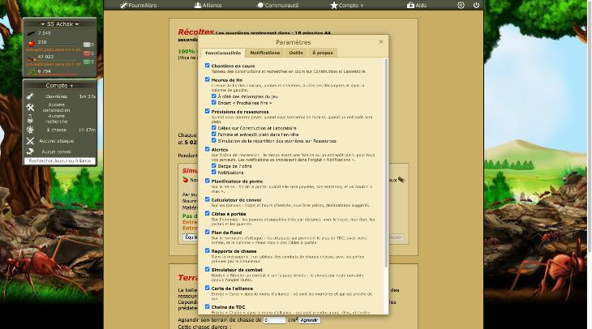
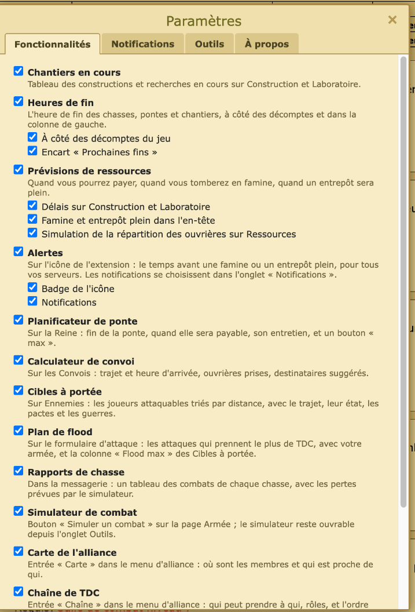
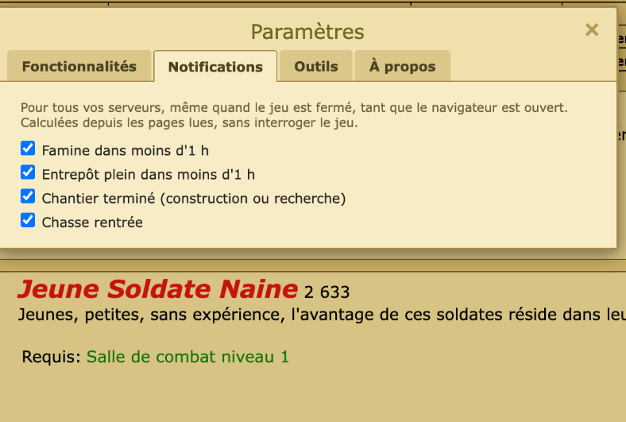

# Revue : Paramètres et Fonctionnalités (`settings`)

- Relecteur : sous-agent D
- Date : 2026-10-08
- Version : `package.json` 1.0.1, commit e228c3a (la section « Notifications », annoncée non commitée, est dans ce commit)
- Pages testées : Reine.php, Ressources.php, commerce.php, laboratoire.php, alliance.php?Membres#carte (s5, Compte+) ; interrupteurs « Calculateur de convoi » puis « Lanceur de chasse » coupés un à la fois puis rétablis ; état initial relevé et revérifié à la fin (23 cases de Fonctionnalités toutes cochées, 4 notifications cochées, permission accordée)
- Doc lue : `docs/features/settings.md`, `docs/features/feature-toggles.md`, `docs/features/alertes.md` (partie Notifications)

## Résumé

L'architecture des interrupteurs est saine : un catalogue typé, une règle unique `isEnabled` (feature puis option), une écriture sérialisée contre les doubles clics, et **chacune des 14 entrées et des 9 options du catalogue est bien lue par son code** (tableau ci-dessous). Le problème principal : des dépendances cachées entre features. Couper le badge, « Heures de fin » ou « Prévisions de ressources » prive les notifications de leurs données, sans que l'interface le dise. La doc des paramètres n'a pas suivi l'ajout des onglets Notifications et Outils.

| Bloquant | Majeur | Mineur | Suggestion |
| -------- | ------ | ------ | ---------- |
| 0        | 2      | 5      | 4          |

### Vérification : chaque entrée du catalogue est-elle respectée ?

| Entrée (`catalog.ts`)                           | Où l'interrupteur est lu                                                         | Verdict                                                                                 |
| ----------------------------------------------- | -------------------------------------------------------------------------------- | --------------------------------------------------------------------------------------- |
| work-queue                                      | `work-queue/index.ts:21` (`toggle`)                                              | ok                                                                                      |
| end-times · inline · recap                      | `end-times/index.ts:22`, `:37`, `:44`                                            | ok, mais voir settings-02 (la section est mémorisée seulement si la feature est active) |
| resource-forecast · costs · outlook · simulator | `resource-forecast/index.ts:28`, `:39-41`                                        | ok                                                                                      |
| alerts · badge · notifications                  | `alerts/index.ts:12`, `:15` ; `alerts/background.ts:23`, `:32`                   | **partiel** : voir settings-01                                                          |
| laying-planner                                  | `laying-planner/index.ts:16`                                                     | ok                                                                                      |
| convoy                                          | `convoy/index.ts:15`                                                             | ok                                                                                      |
| targets                                         | `targets/index.ts:45` (+ colonne Flood max sous `flood`, `targets/index.ts:16`)  | ok                                                                                      |
| flood                                           | `flood/index.ts:60`                                                              | ok                                                                                      |
| hunt-reports                                    | `hunt-reports/index.ts:21`                                                       | ok                                                                                      |
| combat-simulator                                | `combat-simulator/index.ts:14` (le bouton de l'onglet Outils reste, comme prévu) | ok                                                                                      |
| alliance-map                                    | `alliance-map/menu.ts:14` + `entrypoints/alliance-map.content/index.tsx:20`      | ok                                                                                      |
| tdc-chain                                       | `tdc-chain/menu.ts:16` + `entrypoints/tdc-chain.content/index.tsx:21`            | ok                                                                                      |
| history · alliance · profile                    | `history/menu.ts:16`, `:19` + `entrypoints/history.content/index.tsx:106-110`    | ok                                                                                      |
| hunt-launcher                                   | `entrypoints/hunt-launcher.content/index.tsx:13`                                 | ok                                                                                      |

Vérifié en jeu pour une feature légère et une lourde. Avec « Calculateur de convoi » coupé, `commerce.php` n'a ni bloc, ni `datalist`, ni `<style>` Optizzz. Avec « Lanceur de chasse » coupé, `Ressources.php` n'a pas d'hôte `optizzz-hunt-launcher`. Le message « Les changements s'appliquent au prochain chargement de la page. Recharger la page » apparaît dès le premier changement.

Toujours actifs, hors catalogue comme documenté : `settings-menu` et `game-levels`. Les content scripts lourds lisent leur interrupteur avant toute lecture de page ou requête.

## Constats

### settings-01 · Badge coupé : les notifications de famine et d'entrepôt plein n'ont plus de stock à jour

- **Gravité** : majeur
- **Catégorie** : bug
- **Emplacement** : `src/features/alerts/index.ts:15` ; `src/features/alerts/background.ts:32-44` ; `docs/features/alertes.md` (« Données »)
- **Ce qui se passe** : le stock de chaque page n'est mémorisé que si l'option « Badge de l'icône » est active (`if (!isEnabled(toggles, "alerts", "badge")) return;`). Or les notifications « Famine dans moins d'1 h » et « Entrepôt plein dans moins d'1 h » se calculent à partir de ce même stock (`loadServers`). Avec le badge coupé et les notifications actives, le stock se fige et, au-delà de 24 h, aucune notification n'est plus envoyée (règle « pas de notification sur des données de plus de 24 h »). Le joueur ne reçoit plus d'alerte, sans aucun message.
- **Ce qui est attendu** : mémoriser le stock dès que l'une des deux options est active (`badge` **ou** `notifications`), et mettre la doc à jour.
- **Touche aussi** : alerts

### settings-02 · Dépendances cachées entre features

- **Gravité** : majeur
- **Catégorie** : cohérence
- **Emplacement** : `src/features/run.ts:9` (une feature coupée ne s'exécute pas du tout) ; `src/features/end-times/index.ts:28-30` ; `src/features/resource-forecast/index.ts:44-48` ; `src/features/alerts/store.ts:40-41`, `alerts/background.ts:37-39`
- **Ce qui se passe** :
  - Les notifications « Chantier terminé » et « Chasse rentrée » lisent les sections mémorisées par « Heures de fin » (`loadSections`). Si on coupe « Heures de fin », `storeSection` n'est plus appelé (le commentaire de `end-times/index.ts:28` « Kept even with the box switched off » ne vaut que pour l'option, pas pour la feature). Ces deux notifications s'arrêtent sans rien dire.
  - Le badge et les notifications de famine lisent les revenus mémorisés par « Prévisions de ressources ». Si on coupe cette feature, `Ressources.php` ne les mémorise plus. Ils ne sont alors rafraîchis que par hasard (convoi, ponte, qui appellent `loadIncome`), et le badge passe à « ? » au bout de 24 h.
  - À l'inverse, le convoi et la ponte relisent `Ressources.php` en arrière-plan même quand les Prévisions sont coupées.
- **Ce qui est attendu** : séparer la **collecte** des données (mémoriser stock, revenus, sections, toujours active ou active dès qu'un consommateur l'est) de **l'affichage** (coupable). À défaut, l'indiquer dans « Fonctionnalités » (« Nécessaire aux notifications »), griser la notification concernée et documenter ces liens dans `feature-toggles.md`.
- **Touche aussi** : alerts, end-times, resource-forecast, convoy, laying-planner

### settings-03 · L'onglet Notifications ignore l'interrupteur « Alertes › Notifications »

- **Gravité** : mineur
- **Catégorie** : UX
- **Emplacement** : `src/features/settings/dialog.ts:49-53`, `notifications-section.ts:29-89` ; `src/features/catalog.ts:44-53`
- **Ce qui se passe** : deux endroits règlent la même chose : l'option « Notifications » sous « Alertes » dans Fonctionnalités, et les quatre cases de l'onglet Notifications. Si « Alertes » ou son option est coupée, l'onglet Notifications reste actif : on peut cocher, la permission peut être demandée, mais rien ne partira (`background.ts:32`). Aucun message ne le dit.
- **Ce qui est attendu** : dans l'onglet Notifications, un avertissement « Activez Alertes › Notifications dans Fonctionnalités » avec les cases grisées. Ou supprimer l'option du catalogue et laisser les quatre cases seules maîtresses.
- **Touche aussi** : alerts

### settings-04 · Deux clics rapides sur la roue ouvrent deux fenêtres

- **Gravité** : mineur
- **Catégorie** : bug
- **Emplacement** : `src/features/settings/panel.ts:18-21`, `:73-77`
- **Ce qui se passe** : `ui` n'est affecté qu'après `await Promise.all([loadToggles(), loadNotificationSettings()])` puis `await createShadowRootUi(...)`. Un second clic pendant ces `await` voit `ui === undefined` et rouvre. Deux fenêtres se superposent, la première n'est plus référencée (le × et Échap ne ferment que la seconde, et Échap ferme les deux écouteurs).
- **Vu en jeu** (Ressources.php, deux `click()` enchaînés sur la roue) : deux hôtes `optizzz-settings`. Échap en retire un ; l'autre reste à l'écran et **ni Échap ni × ne le ferment** (il faut recharger la page).
- **Ce qui est attendu** : garder une promesse d'ouverture en cours (`opening`) et l'ignorer ou l'attendre au second clic.
- **Capture** : 
- **Touche aussi** : —

### settings-05 · « Notifications bloquées par le navigateur » alors que rien n'a été refusé

- **Gravité** : mineur
- **Catégorie** : UX
- **Emplacement** : `src/features/settings/notifications-section.ts:40-53`
- **Ce qui se passe** : le message s'affiche dès que la permission optionnelle n'est pas accordée, ce qui inclut le cas normal « jamais demandée » (ou demande fermée sans réponse). Le mot « bloquées » laisse croire à un refus dans les réglages du navigateur. Le texte est en rouge `#c00`, codé en dur.
- **Ce qui est attendu** : « Autorisation nécessaire pour afficher les notifications · Autoriser ». Garder « bloquées » pour un refus explicite (s'il est détectable).
- **Touche aussi** : alerts

### settings-06 · `settings.md` décrit l'état d'avant Notifications et Outils

- **Gravité** : mineur
- **Catégorie** : doc
- **Emplacement** : `docs/features/settings.md` (« Onglets », « Pas de React… Aucune permission ajoutée », table « Fichiers ») ; `src/features/settings/index.ts:5`
- **Ce qui se passe** : la doc liste « Fonctionnalités, Outils, À propos » (il y a maintenant Notifications en deuxième). Elle affirme « Aucune permission ajoutée » alors que l'onglet demande la permission optionnelle `notifications` via `notifications-permission.html`. La table des fichiers ne cite ni `notifications-section.ts` ni `tools-section.ts`. Le commentaire de `index.ts:5` dit encore « (« À propos » for now) ».
- **Ce qui est attendu** : doc et commentaire alignés sur les quatre onglets et la permission optionnelle.
- **Touche aussi** : alerts

### settings-07 · Le tableau de `feature-toggles.md` ne liste que 4 features sur 14

- **Gravité** : mineur
- **Catégorie** : doc
- **Emplacement** : `docs/features/feature-toggles.md` (tableau « Feature / Sous-options »)
- **Ce qui se passe** : seules Chantiers en cours, Prévisions, Carte et Lanceur de chasse y figurent. Manquent les sous-options de Heures de fin (inline, recap), Alertes (badge, notifications) et Historique (alliance, profil). La phrase « Un content script lourd (carte, chasse) » oublie Chaîne et Historique.
- **Ce qui est attendu** : renvoyer à `catalog.ts` comme source de vérité, ou tenir le tableau à jour.
- **Touche aussi** : —

### settings-08 · Aucun test ne garantit qu'une entrée du catalogue a un consommateur

- **Gravité** : suggestion
- **Catégorie** : code
- **Emplacement** : `src/features/catalog.ts`, `src/features/run.test.ts`, `src/features/toggles.test.ts`
- **Ce qui se passe** : la vérification ci-dessus a été faite à la main. Une entrée ou une option ajoutée au catalogue mais jamais lue (ou un `toggle` oublié sur une nouvelle feature légère) passerait les tests.
- **Ce qui est attendu** : un test qui vérifie que chaque `id` du catalogue est le `toggle` d'une feature du registre ou figure dans une liste explicite de content scripts lourds, et qu'aucune feature du registre visible n'est sans `toggle` hors `settings-menu` / `game-levels`.
- **Touche aussi** : —

### settings-09 · Accessibilité de la fenêtre et des onglets

- **Gravité** : suggestion
- **Catégorie** : UX
- **Emplacement** : `src/features/settings/dialog.ts:94-150`, `panel.ts:61-66`
- **Ce qui se passe** : `role="dialog"` sans déplacement du focus à l'ouverture ni retour sur la roue à la fermeture. Onglets `role="tab"` sans `aria-controls`, sans navigation au clavier par flèches, sans `tabindex` géré.
- **Vu en jeu** : la hauteur de la fenêtre change d'un onglet à l'autre (pleine hauteur sur Fonctionnalités, avec ascenseur interne ; quelques lignes sur Notifications et À propos), si bien que les onglets « sautent » sous la souris. Captures :  .
- **Ce qui est attendu** : focus sur le premier onglet à l'ouverture et retour sur la roue à la fermeture ; flèches gauche/droite entre onglets ; une hauteur stable (celle du plus grand onglet, ou une hauteur fixe).
- **Touche aussi** : —

### settings-10 · Roue dentée : couleur et marge forcées dans le DOM du jeu

- **Gravité** : suggestion
- **Catégorie** : UI
- **Emplacement** : `src/features/settings/menu-button.ts:28-47`
- **Ce qui se passe** : styles en ligne (dont `color: rgb(211, 217, 184)` copié du jeu) et `marginRight` de `#menu_horizontal` augmenté de 45 px pour faire de la place. En jeu à 1 728 px CSS de large, la roue est bien dans la barre : bouton 1 323–1 368 px, déconnexion 1 368–1 413 px, `nav#menu` 302–1 413 px, et `elementFromPoint` au centre renvoie bien le SVG de la roue. Le comportement aux petites largeurs n'a pas pu être testé (redimensionnement sans effet).
- **Ce qui est attendu** : `color: inherit` ou une variable partagée ; vérifier le comportement quand la barre passe sur deux lignes.
- **Touche aussi** : transverse-ui

### settings-11 · Popup et page de permission recopient la palette de la fenêtre

- **Gravité** : suggestion
- **Catégorie** : UI
- **Emplacement** : `src/entrypoints/popup/main.ts:8-12`, `src/entrypoints/notifications-permission/main.ts:5` ; `src/features/settings/dialog.ts:60-91`
- **Ce qui se passe** : fond `#efe0ad`, police Verdana 12 px et couleur `#222` sont réécrits dans trois fichiers ; les onglets (`TABS_STYLE`) sont partagés, mais pas la base.
- **Ce qui est attendu** : un `BASE_STYLE` (ou des variables CSS) commun à la fenêtre, la popup et la page de permission.
- **Touche aussi** : transverse-ui, alerts

## Questions ouvertes

### Q1 · Faut-il deux niveaux d'interrupteur pour les notifications ?

- **Observation** : « Alertes › Notifications » (catalogue) et les quatre cases de l'onglet Notifications se recouvrent (settings-03).
- **Hypothèses** : 1) voulu : un interrupteur maître pour tout couper d'un coup sans perdre le choix des quatre cases ; 2) héritage du cadrage du badge, à simplifier.
- **Comment trancher** : question au joueur.

### Q2 · Données mémorisées quand une feature est coupée

- **Observation** : `feature-toggles.md` promet « Rien n'est injecté, aucune requête, aucune lecture de page » pour une feature coupée. C'est ce qui casse les notifications (settings-02).
- **Hypothèses** : 1) la promesse prime : il faut alors documenter et afficher les dépendances ; 2) la collecte locale (sans requête) peut rester active : il faut alors reformuler la promesse.
- **Comment trancher** : question au joueur.

## Préparation au mode « moderne »

- **Facilite** : la fenêtre est dans un Shadow DOM (`createShadowRootUi`), isolée du CSS du jeu. Tout son style vient de chaînes exportées (`DIALOG_STYLE`, `TABS_STYLE`, `FEATURES_STYLE`, `NOTIFICATIONS_STYLE`, `TOOLS_STYLE`, `ABOUT_STYLE`), partagées avec la popup. Un thème peut donc être appliqué à un seul endroit. La structure (onglets `settingsTabs`) prévoit déjà un futur onglet « Thèmes ».
- **Bloque** : 21 couleurs codées en dur dans `settings/` (13 dans `dialog.ts`, 2 + 2 + 2 + 1 + 1 dans les sections et la roue), plus 2 dans la popup et 5 dans la page de permission ; aucune variable CSS. `#6b5d3a` (texte secondaire) est répété dans 4 fichiers de `settings/`. Tailles en px (11, 12, 15, 18, 26).

## Signalements des autres relecteurs

- **B : « le premier clic sur la roue après un chargement n'ouvre pas le panneau »**. Reproduit, mais ce n'est **pas un bug d'Optizzz**. Après une navigation, les clics de l'outil envoyés avant toute capture d'écran n'atteignent pas la page : un écouteur `click` en phase de capture sur `document` ne reçoit rien. Après une capture, le premier clic ouvre la fenêtre (vérifié sur Reine.php et Ressources.php ; journal : `doc:svg`, puis le `click` du bouton). Une ouverture par `button.click()` marche toujours du premier coup.
- **C : « le rectangle du bouton (x ≈ 1 338–1 383) déborde de la barre (qui s'arrête vers 1 205 px) »**. Ce n'est **pas un débordement** : `getBoundingClientRect` donne des px CSS (viewport de 1 728 px), alors que les captures sont réduites (1 459 ou 1 512 px de large, facteur 1,14 à 1,18). Dans le même repère CSS, la barre va jusqu'à 1 413 px et contient la roue.

## Hors périmètre / non testé

- settings-05 n'a pas pu être vu en jeu : la permission est déjà accordée et les quatre cases sont cochées, donc aucun message « bloquées ». Les cases et la permission ont seulement été observées, pas modifiées.
- settings-01 et settings-02 (données des notifications) : non vérifiables sans couper le badge ou « Heures de fin » pendant plusieurs heures. Ils sont établis par le code.
- Popup de l'icône : non ouverte (barre d'outils du navigateur hors de portée des outils).
- Petites largeurs : le redimensionnement de la fenêtre est sans effet ici. La fenêtre a `max-width: calc(100vw - 32px)` et `max-height: calc(100vh - 140px)` (code), non vérifiés en jeu.
- Seules deux features ont été coupées en jeu (une légère, une lourde), pour limiter les rechargements. Le tableau de vérification vient du code pour les autres.
- Remarque d'outillage : la fenêtre Paramètres n'apparaît pas dans l'arbre d'accessibilité lu par l'outil (`find`), alors que son Shadow DOM est ouvert. Elle a été lue par `shadowRoot` en JavaScript.
