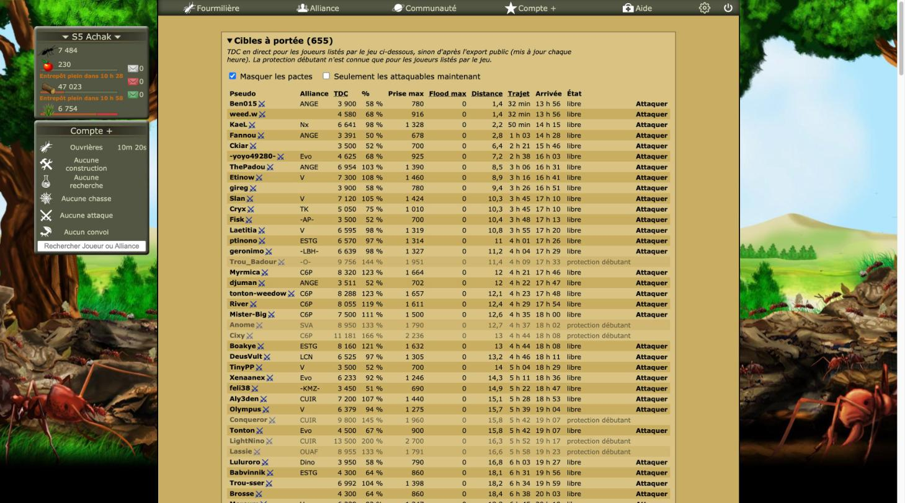

# Revue : Cibles à portée (`targets`)

- Relecteur : sous-agent C
- Date : 2026-10-08
- Version : `package.json` 1.0.1, commit e228c3a (aucune modification non commitée hors `docs/reviews/`)
- Pages testées : `ennemie.php` (tri, filtres, repli mémorisé, Plan de flood coupé puis rallumé), `ennemie.php?Attaquer=1187&lieu=1` (rien des Cibles ne doit y apparaître), `Armee.php`
- Doc lue : `docs/features/cibles.md` (+ `docs/research/fourmizzz-pages.md` « ennemie.php », `docs/research/fourmizzz-api-exports.md`, `docs/research/temps-de-trajet.md`)

## Résumé

C'est l'encart le plus « natif » de la zone : couleurs et bord du jeu, icône de riposte du jeu, 655 cibles listées, tri instantané (environ 10 ms), filtres et repli qui marchent. Un seul défaut sérieux : « Flood max » ignore les attaques en route. En jeu, avec une armée vide, la colonne affiche 0 sur toutes les lignes sans explication. Enfin, l'encart propose « Attaquer » sur des centaines de lignes sans relayer l'avertissement du jeu : attaquer fait perdre sa propre protection débutant.

| Bloquant | Majeur | Mineur | Suggestion |
| -------- | ------ | ------ | ---------- |
| 0        | 1      | 6      | 3          |

## Constats

### targets-01 · « Flood max » ignore les attaques en route

- **Gravité** : majeur
- **Catégorie** : bug
- **Emplacement** : `src/features/targets/index.ts:15-35` ; `src/features/targets/mount.ts:140-164` ; à comparer avec `src/features/flood/mount.ts:116-121`
- **Ce qui se passe** : la colonne retire des créneaux libres les attaques notées, mais :
  - mon TDC n'inclut pas les prises en route ;
  - le TDC des cibles déjà attaquées n'est pas diminué ;
  - les attaques lancées sans Optizzz ne sont pas comptées ;
  - une attaque annulée depuis la dernière visite d'`Armee.php` occupe encore un créneau.

  En plein flood, la colonne et le Plan de flood donnent deux chiffres différents pour la même cible. Constat tiré du code : non vérifiable en jeu, faute d'armée et d'attaque en cours.

- **Ce qui est attendu** : le même contexte que le Plan de flood, calculé dans une fonction commune.
- **Touche aussi** : flood

### targets-02 · Armée vide : « Flood max » affiche 0 partout

- **Gravité** : mineur
- **Catégorie** : UX
- **Emplacement** : `src/features/targets/index.ts:25-34` ; `mount.ts:227-233`
- **Ce qui se passe** : la garnison mémorisée sur `Armee.php` est vide (aucune unité). La colonne existe quand même et affiche « 0 » sur les 655 lignes. Son infobulle dit « Avec vos 4 attaques possibles et votre armée, sans défense en face ». Le tri par « Flood max » ne trie alors rien.
- **Ce qui est attendu** : masquer la colonne quand l'armée est vide, comme quand elle est inconnue, ou afficher « — » avec l'infobulle « aucune unité en garnison ».
- **Capture** : 
- **Touche aussi** : flood

### targets-03 · Aucun rappel que le joueur protégé perd sa protection en attaquant

- **Gravité** : mineur
- **Catégorie** : UX
- **Emplacement** : `src/features/targets/mount.ts:239-246,278-279` ; `ennemie.php` (message du jeu sous son formulaire)
- **Ce qui se passe** : sous son formulaire de recherche, le jeu prévient : « Vous profitez de la protection débutant des 7 premiers jours. Si vous attaquez, vous ne serez plus protégés… ». L'encart, inséré au-dessus, est long (50 lignes) et repousse ce message bien plus bas. Il propose « Attaquer » sur 608 lignes, sans rappel. Le Plan de flood, sous le formulaire d'attaque, ne le dit pas non plus.
- **Ce qui est attendu** : quand le joueur est protégé, un bandeau dans l'encart (et dans le Plan de flood), ou une infobulle sur « Attaquer ».
- **Touche aussi** : flood, tdc-chain

### targets-04 · « Attaquer » proposé pour des joueurs peut-être protégés

- **Gravité** : mineur
- **Catégorie** : UX
- **Emplacement** : `src/features/targets/targets.ts:96-103,143`
- **Ce qui se passe** : la protection n'est connue que pour les 200 lignes du tableau du jeu. Parmi elles, 49 sont « Nouveau » (25 %). Les cibles proches, comme Ben015 ou weed.w, ne sont pas dans ce tableau (le jeu trie par TDC décroissant). Elles sont donc « libre » d'après l'export, avec « Attaquer », alors qu'environ une sur quatre est sans doute protégée. La note de l'encart le dit, mais rien ne distingue ces lignes.
- **Ce qui est attendu** : un état marqué comme incertain (« libre ? ») pour ce qui vient de l'export.
- **Touche aussi** : —

### targets-05 · Une panne de l'API supprime l'encart sans message

- **Gravité** : mineur
- **Catégorie** : UX
- **Emplacement** : `src/features/targets/index.ts:52-58`
- **Ce qui se passe** : le `Promise.all` rejette, et rien ne s'affiche hormis une ligne dans la console. Non reproduit en jeu, l'API répondait.
- **Ce qui est attendu** : l'encart, avec un message en clair.
- **Touche aussi** : flood

### targets-06 · Format du trajet et de la distance différent de la Carte et de la Chaîne

- **Gravité** : mineur
- **Catégorie** : cohérence
- **Emplacement** : `src/features/targets/mount.ts:234-235`
- **Ce qui se passe** : en jeu, l'encart écrit « 1,4 » et « 4 h 37 ». La Carte écrit « 23.1 » et « 8h 14m 13s », le profil du jeu « 10H 1m 2s ». Voir alliance-map-05.
- **Ce qui est attendu** : un seul format.
- **Touche aussi** : alliance-map, tdc-chain, flood

### targets-07 · La doc annonce ⚔, le code affiche l'icône du jeu

- **Gravité** : mineur
- **Catégorie** : doc
- **Emplacement** : `docs/features/cibles.md` (« Colonnes », Pseudo) ; `src/features/targets/mount.ts:205-214`
- **Ce qui se passe** : en jeu, c'est l'icône `icone_degat_defense.gif` du jeu qui s'affiche, ce qui est un bon choix, mais la doc parle de ⚔. Presque toutes les lignes l'ont, car presque tout le monde peut riposter : l'icône apporte peu.
- **Ce qui est attendu** : une doc à jour. Éventuellement, marquer plutôt ceux qui **ne peuvent pas** riposter.
- **Touche aussi** : —

### targets-08 · En-têtes triables sans repère de tri et inaccessibles au clavier

- **Gravité** : suggestion
- **Catégorie** : UX
- **Emplacement** : `src/features/targets/mount.ts:171-185`
- **Ce qui se passe** : en jeu, rien n'indique la colonne active après un clic sur « TDC ». L'Historique, lui, affiche ▼ ou ▲. Le `<th>` ne prend pas le focus clavier.
- **Ce qui est attendu** : une flèche et un `<button>`, dans un composant commun.
- **Touche aussi** : history

### targets-09 · Tri « Flood max » : un plan calculé pour chaque cible

- **Gravité** : suggestion
- **Catégorie** : code
- **Emplacement** : `src/features/targets/mount.ts:140-169,250-256`
- **Ce qui se passe** : le tri a pris 10 ms en jeu, mais avec une armée vide. Avec une armée, et des défenses collées (recherche dichotomique de `firstWave`), il reste à mesurer. Le cache est vidé à chaque rendu.
- **Ce qui est attendu** : garder le cache entre les rendus.
- **Touche aussi** : flood

### targets-10 · Dépendances vers d'autres features

- **Gravité** : suggestion
- **Catégorie** : code
- **Emplacement** : `src/features/targets/index.ts:2-10` ; `targets.ts:4`
- **Ce qui se passe** : la feature importe depuis `alliance-map/`, `resource-forecast/`, `combat-simulator/` et `flood/`. Voir alliance-map-13.
- **Ce qui est attendu** : des briques partagées dans `src/`.
- **Touche aussi** : alliance-map, flood

## Questions ouvertes

### Q1 · Peut-on attaquer un joueur colonisé ?

- **Observation** : `attackableNow` vaut vrai pour « colonisé » (`targets.ts:143`). Le tableau du jeu montre deux lignes « Soumis à … ». Je n'ai pas regardé si elles ont un lien d'attaque.
- **Hypothèses** : 1) oui, pour tous ; 2) seulement pour certains.
- **Comment trancher** : regarder la cellule 4 de ces lignes dans `#tabEnnemie`, ou l'aide du jeu.

### Q2 · Guerre déclarée d'un seul côté

- **Observation** : aucune ligne en guerre ni en pacte n'était visible (13 pactes masqués par défaut). Les couleurs n'ont donc pas été vues.
- **Hypothèses** : 1) le jeu colore les deux sens ; 2) seulement les guerres déclarées par mon alliance.
- **Comment trancher** : comparer avec les couleurs du jeu quand une guerre existe.

## Préparation au mode « moderne »

- **Facilite** : classes préfixées, état porté par des classes (`-war`, `-pact`, `-inactive`).
- **Bloque** : couleurs en dur dans une chaîne JS injectée dans le `<head>` (`mount.ts:8-24`) ; palette recopiée du Plan de flood ; icône chargée par un chemin relatif du jeu.

## Hors périmètre / non testé

- Flood max avec une vraie armée : la garnison est vide sur ce compte.
- Le formulaire de recherche POST du jeu n'a pas été envoyé.
- **Réglages remis dans leur état initial** : encart déplié (replié, rechargé, mémorisation constatée, puis redéplié) ; filtres et tri non mémorisés, revenus par défaut au rechargement ; « Plan de flood » coupé (la colonne disparaît bien), puis rallumé et vérifié.
- **Petites largeurs**, simulées par `javascript_tool` :
  - `body` à 800 px casse la mise en page fixe du jeu (`#centre` à 180 px), donc ce test n'est pas représentatif ;
  - l'encart limité à 400 px (`max-width`) défile bien à l'horizontale (`overflow-x: auto`, contenu de 825 px).

  Simulations annulées.

- Console : aucune erreur.
