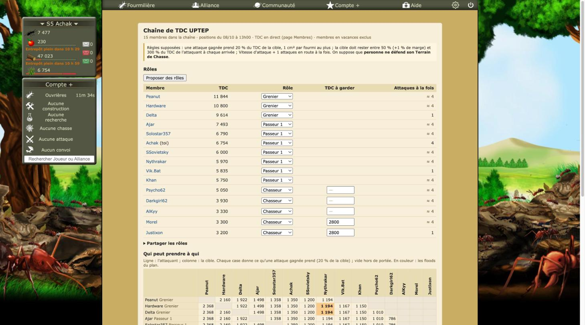
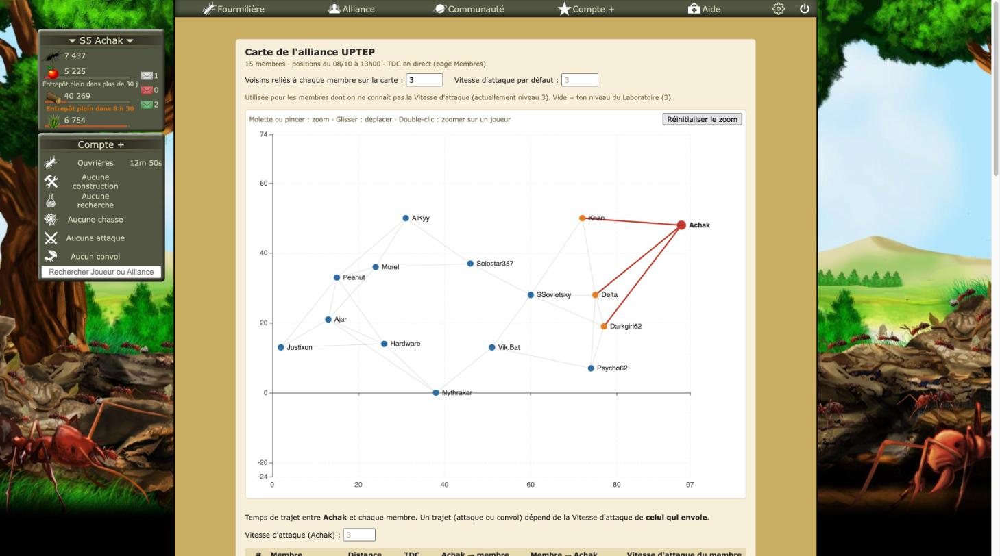
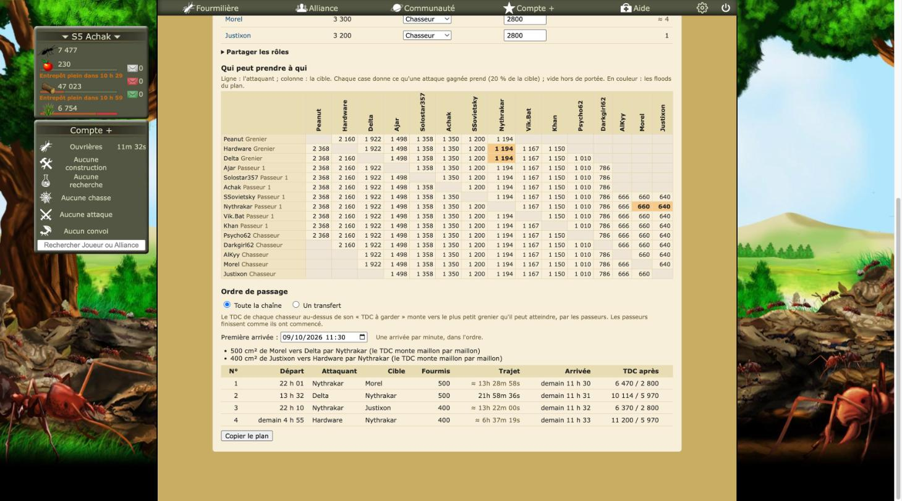

# Revue : Chaîne de TDC (`tdc-chain`)

- Relecteur : sous-agent C
- Date : 2026-10-08
- Version : `package.json` 1.0.1, commit e228c3a (aucune modification non commitée hors `docs/reviews/`)
- Pages testées : `alliance.php?Membres#chaine` (chargée directement, puis atteinte depuis `#carte` et `#historique`), mode « Un transfert » (Justixon vers Peanut, choix non mémorisé), panneau « Paramètres » d'Optizzz
- Doc lue : `docs/features/chaine-tdc.md` (+ `docs/features/flood.md`, `docs/research/temps-de-trajet.md`, `docs/research/fourmizzz-api-exports.md`)

## Résumé

Chargée directement, la vue est complète et lisible. On y trouve les rôles enregistrés, le tableau « Qui peut prendre à qui » avec ses en-têtes verticaux, le plan de la chaîne (2 transferts, 4 attaques), le mode « Un transfert », et aucun lien qui lance quoi que ce soit. Deux problèmes dominent. Après un passage par la Carte ou l'Historique, la Chaîne s'affiche **sous** ces vues (bug commun, alliance-map-01). Et les horaires du plan ne suivent pas l'ordre des départs, alors que c'est l'ordre dans lequel le joueur doit agir.

| Bloquant | Majeur | Mineur | Suggestion |
| -------- | ------ | ------ | ---------- |
| 0        | 2      | 10     | 2          |

Vue d'ensemble : 

## Constats

### tdc-chain-01 · La Chaîne s'affiche sous la Carte et l'Historique déjà ouverts

- **Gravité** : majeur
- **Catégorie** : bug
- **Emplacement** : `src/entrypoints/tdc-chain.content/index.tsx:53-57` (et les scripts de la Carte et de l'Historique)
- **Ce qui se passe** : en jeu, j'ai ouvert `#historique`, puis cliqué « Carte », puis « Chaîne ». Les trois vues restent affichées et la Chaîne commence 2 469 px plus bas. Le joueur qui clique « Chaîne » voit la Carte et croit que le lien ne marche pas. La cause : la réinitialisation `:host{all:initial !important}` de WXT annule `display: none` (voir alliance-map-01).
- **Ce qui est attendu** : une seule vue visible.
- **Capture** :  (URL en `#chaine`, la Carte occupe l'écran)
- **Touche aussi** : alliance-map, history

### tdc-chain-02 · Chaîne coupée : `#chaine` affiche une page vide

- **Gravité** : majeur
- **Catégorie** : bug
- **Emplacement** : `src/utils/alliance-views.ts:4-7`
- **Ce qui se passe** : constaté en jeu avec la Carte coupée et `#carte` (alliance-map-02). Le code est le même pour `#chaine` : la Carte et l'Historique masquent le tableau des membres sans que la Chaîne monte sa vue. La doc promet le contraire (« coupé, ni menu ni vue »).
- **Ce qui est attendu** : le tableau des membres.
- **Capture** : voir 
- **Touche aussi** : alliance-map, history

### tdc-chain-03 · Les départs du plan ne sont pas dans l'ordre chronologique

- **Gravité** : mineur
- **Catégorie** : UX
- **Emplacement** : `src/features/tdc-chain/TdcChain.tsx:469-526` ; `schedule.ts:15-20` ; `plan-text.ts:19-22`
- **Ce qui se passe** : le plan est trié par arrivée, une par minute, et les trajets varient de 6 h à 22 h. En jeu, la colonne « Départ » se lisait donc « 22 h 01, 13 h 32, 22 h 10, demain 4 h 55 ». Un membre doit parcourir tout le tableau, ou tout le message copié, pour trouver qui part en premier. La colonne « TDC après » (« 6 470 / 2 800 ») ne dit pas non plus lequel des deux chiffres est l'attaquant.
- **Ce qui est attendu** : un tri par départ proposé (l'ordre d'arrivée resterait visible par le N°), et des en-têtes « TDC attaquant / cible ».
- **Capture** : 
- **Touche aussi** : —

### tdc-chain-04 · Les niveaux saisis sur la Carte n'arrivent pas dans la Chaîne sans recharger la page

- **Gravité** : mineur
- **Catégorie** : bug
- **Emplacement** : `src/features/tdc-chain/TdcChain.tsx:85-95`
- **Ce qui se passe** : la Chaîne lit les réglages de la Carte une seule fois, au montage. Si je saisis un niveau sur `#carte` puis clique « Chaîne », les valeurs restent anciennes jusqu'au rechargement. Constat tiré du code, non reproduit en jeu pour ne pas modifier les niveaux enregistrés.
- **Ce qui est attendu** : `storage.watch`, ou une relecture quand la vue redevient visible.
- **Touche aussi** : alliance-map

### tdc-chain-05 · Le flood recopié au lieu d'être partagé avec `src/game/flood.ts`

- **Gravité** : mineur
- **Catégorie** : code
- **Emplacement** : `src/features/tdc-chain/chain.ts:6,47-48,54-77` contre `src/game/flood.ts:28-33,39-65`
- **Ce qui se passe** : `link()` reprend `planFlood` (prises de 20 %, prise limite, dernière prise de 20 %). `inRangeWithMargin` et `fullTake` sont des copies. Les deux versions divergent déjà sur le moment où la marge est vérifiée.
- **Ce qui est attendu** : des primitives communes dans `src/game/flood.ts`.
- **Touche aussi** : flood, targets

### tdc-chain-06 · Portée sans marge dans le tableau et les rôles proposés, avec marge dans le plan

- **Gravité** : mineur
- **Catégorie** : cohérence
- **Emplacement** : `src/features/tdc-chain/chain.ts:11` ; `roles.ts:27` ; `chain.ts:47-48`
- **Ce qui se passe** : entre 50 % et 50,5 % du TDC de l'attaquant, une case de « Qui peut prendre à qui » est remplie et la proposition de rôles compte la cible dans l'échelon du dessous. Le plan, lui, la juge hors de portée et peut conclure « il faudrait un passeur ».
- **Ce qui est attendu** : la même règle partout, ou la limite visible dans le tableau.
- **Touche aussi** : flood

### tdc-chain-07 · Les tableaux Rôles et plan n'ont pas de défilement horizontal

- **Gravité** : mineur
- **Catégorie** : UI
- **Emplacement** : `src/features/tdc-chain/style.css:87-98,117-119`
- **Ce qui se passe** : seul `.matrix` défile horizontalement. Le plan (9 colonnes `nowrap`, avec « demain 4 h 55 ») et les rôles (avec un `<select>` et un champ) n'ont pas de conteneur qui défile. À 1 459 px, tout tient dans le cadre de 900 px. En dessous, ce n'est pas vérifié : la simulation par `javascript_tool` casse la mise en page fixe du jeu (voir « Hors périmètre »).
- **Ce qui est attendu** : un conteneur `overflow-x: auto` par tableau.
- **Touche aussi** : —

### tdc-chain-08 · « Chacun retrouve le même plan » : vrai seulement si la première arrivée est fixée

- **Gravité** : mineur
- **Catégorie** : UX
- **Emplacement** : `src/features/tdc-chain/TdcChain.tsx:28,93,164` ; `schedule.ts:23-27` ; `docs/features/chaine-tdc.md`
- **Ce qui se passe** : la première arrivée par défaut dépend de l'heure de celui qui regarde, se recalcule toutes les 30 s et s'arrondit aux 5 minutes. En jeu, elle valait « demain 11 h 30 », imposée par le trajet de 21 h 58 de Delta (niveau 0 saisi sur la Carte). Deux membres qui ouvrent la vue à 5 minutes d'écart voient d'autres horaires.
- **Ce qui est attendu** : une première arrivée figée à l'ouverture ou à la copie, et une doc nuancée.
- **Touche aussi** : —

### tdc-chain-09 · Un nouveau membre est mis « Hors chaîne » sans le dire

- **Gravité** : mineur
- **Catégorie** : UX
- **Emplacement** : `src/features/tdc-chain/TdcChain.tsx:122-125`
- **Ce qui se passe** : dès que des rôles sont enregistrés, un membre absent des réglages reçoit `OUT`, ce qui l'exclut en silence. En jeu, les 15 membres avaient tous un rôle.
- **Ce qui est attendu** : un avertissement « N membres sans rôle », ou le rôle proposé d'après leur TDC.
- **Touche aussi** : —

### tdc-chain-10 · « Copier le plan » sans solution de repli

- **Gravité** : mineur
- **Catégorie** : UX
- **Emplacement** : `src/features/tdc-chain/TdcChain.tsx:208-215`
- **Ce qui se passe** : si le presse-papiers refuse, le joueur lit seulement « Impossible de copier le plan. » Le partage des rôles, lui, affiche le texte à copier à la main. Non cliqué en jeu.
- **Ce qui est attendu** : le même repli.
- **Touche aussi** : alliance-map

### tdc-chain-11 · L'import ne tolère pas les accents dans les pseudos, contrairement à ce que dit la doc

- **Gravité** : mineur
- **Catégorie** : doc
- **Emplacement** : `src/features/tdc-chain/roles.ts:98,105` ; `roles.test.ts:87` ; `docs/features/chaine-tdc.md`
- **Ce qui se passe** : pour le pseudo, seule la casse est ignorée. Les accents ne sont retirés que du libellé du rôle.
- **Ce qui est attendu** : appliquer `plain()` au pseudo, ou corriger la doc et le titre du test.
- **Touche aussi** : alliance-map

### tdc-chain-12 · Messages communs aux vues : fréquence des exports, erreurs, exclus

- **Gravité** : mineur
- **Catégorie** : UX
- **Emplacement** : `src/features/tdc-chain/TdcChain.tsx:86,168,173-174,237`
- **Ce qui se passe** : on retrouve « chaque nuit à minuit » et l'erreur brute (alliance-map-06 et 10). Le bandeau dit « membres en vacances exclus », alors que les bannis le sont aussi.
- **Ce qui est attendu** : des messages communs.
- **Touche aussi** : alliance-map, history

### tdc-chain-13 · Mes attaques déjà en route ne sont pas déduites

- **Gravité** : suggestion
- **Catégorie** : cohérence
- **Emplacement** : `src/features/tdc-chain/TdcChain.tsx:132-137` ; `src/features/flood/mount.ts:117-121`
- **Ce qui se passe** : « Attaques à la fois » vaut toujours Vitesse d'attaque + 1, alors que le Plan de flood déduit les attaques en route.
- **Ce qui est attendu** : reprendre, pour moi, les créneaux libres connus du Plan de flood.
- **Touche aussi** : flood

### tdc-chain-14 · Vue de 617 lignes sans test

- **Gravité** : suggestion
- **Catégorie** : code
- **Emplacement** : `src/features/tdc-chain/TdcChain.tsx:155-230`
- **Ce qui se passe** : trajets, créneaux, lancements et `gapText` sont de la logique pure, mais restent dans la vue, sans test.
- **Ce qui est attendu** : un module pur, testé.
- **Touche aussi** : —

## Questions ouvertes

### Q1 · Fuseau horaire des départs et arrivées

- **Observation** : les heures suivent le fuseau du navigateur (`utils/time-format.ts:22`), et le champ `datetime-local` aussi (affiché « 09/10/2026 11:30 »). Le jeu affiche l'heure de Paris.
- **Hypothèses** : 1) tous les joueurs sont à l'heure de Paris ; 2) un joueur à l'étranger diffuse des horaires décalés.
- **Comment trancher** : décider d'afficher partout l'heure de Paris (question transverse).

### Q2 · Un membre colonisé peut-il attaquer ou être attaqué dans la chaîne ?

- **Observation** : les colonisés sont gardés (⛓). Aucun membre n'est colonisé sur S5.
- **Hypothèses** : 1) cela ne change rien ; 2) des restrictions s'appliquent.
- **Comment trancher** : aide du jeu, Calystene.

### Q3 · Joueurs sous protection débutant

- **Observation** : sur S5, les membres sont protégés (le profil de Delta indique « Ce joueur bénéficie de la protection débutant »). Le jeu prévient aussi : « Si vous attaquez, vous ne serez plus protégés ».
- **Hypothèses** : 1) on peut attaquer un membre de son alliance même protégé ; 2) non, et alors tout le plan est impossible tant que dure la protection.
- **Comment trancher** : aide du jeu, ou question au joueur.

## Préparation au mode « moderne »

- **Facilite** : Shadow DOM, classes sémantiques (`.used`, `.none`, `.mine`, `.late`, `.out`).
- **Bloque** : couleurs en dur dans `style.css`, bloc de base recopié de la Carte et de l'Historique, styles en ligne du menu. La réinitialisation WXT empêche de styler l'hôte depuis l'extérieur.

## Hors périmètre / non testé

- Rôles, « TDC à garder », « Proposer des rôles », import et « Copier le plan » : non cliqués, pour ne pas modifier les réglages enregistrés. Le mode « Un transfert » n'est pas mémorisé, et un rechargement l'a remis à « Toute la chaîne ».
- Le lien « Attaquer » (absent : aucune attaque de Achak dans le plan) n'a pas été suivi.
- La Chaîne n'a pas été coupée dans les paramètres : le comportement est déduit du test de la Carte (même code). L'état initial des paramètres (tout allumé) a été vérifié en fin de test.
- Petites largeurs : la simulation par `javascript_tool` (`body.style.width`) casse la mise en page fixe du jeu ; non représentative, annulée.
- Console : aucune erreur.
