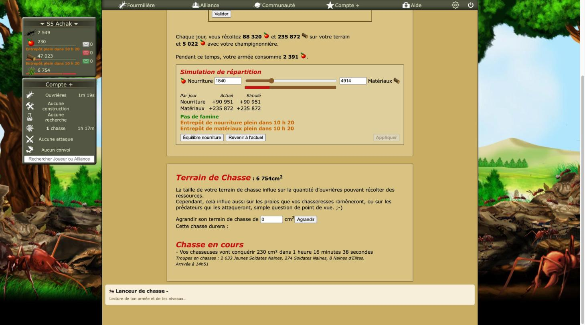
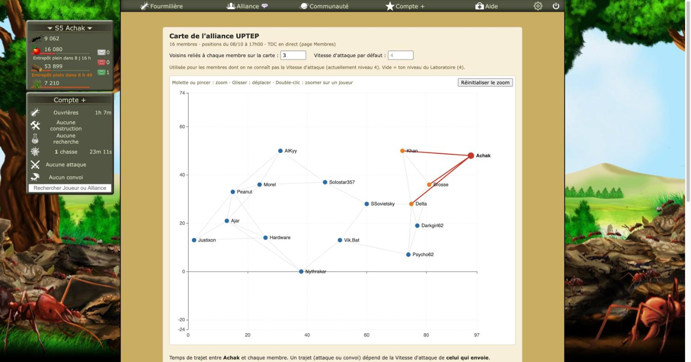

# Revue : Cohérence visuelle et briques partagées (`transverse-ui`)

- Relecteur : sous-agent D
- Date : 2026-10-08
- Version : `package.json` 1.0.1, commit e228c3a
- Pages testées : Reine.php, Ressources.php, commerce.php, alliance.php?Membres#carte (s5, Compte+), plus l'inventaire par `grep` sur `src/` (tests et fixtures exclus)
- Doc lue : `CLAUDE.md`, `docs/adr/0001-stack-ui-carte.md` (Shadow DOM des features lourdes), pages `docs/features/` citées

## Résumé

Chaque feature a soigné son rendu à sa façon, souvent proche du jeu (parchemin, Verdana, classes `optizzz-*` préfixées dans le DOM du jeu). Mais il n'existe aucun socle commun : **156 couleurs codées en dur (67 valeurs distinctes) dans 24 fichiers, zéro variable CSS de thème**, trois manières d'injecter du style, deux formats de durée et deux séparateurs de milliers. C'est le principal frein à un mode « moderne ». Plusieurs briques génériques (lecture des pages, export public, petites fonctions de parsing) vivent dans une feature et sont importées par les autres.

| Bloquant | Majeur | Mineur | Suggestion |
| -------- | ------ | ------ | ---------- |
| 0        | 1      | 8      | 3          |

## Inventaire chiffré

### Couleurs codées en dur par fichier

`grep -rnoE "#[0-9a-fA-F]{3,8}\b|rgba?\([^)]*\)|hsla?\([^)]*\)"` sur `.ts`, `.tsx`, `.css`, `.html` de `src/`, hors tests et fixtures : 156 occurrences.

| Fichier                                         | Couleurs | Mode d'injection                  |
| ----------------------------------------------- | -------- | --------------------------------- |
| `features/hunt-launcher/style.css`              | 24       | Shadow DOM (React)                |
| `features/tdc-chain/style.css`                  | 20       | Shadow DOM (React)                |
| `features/alliance-map/style.css`               | 16       | Shadow DOM (React)                |
| `features/history/style.css`                    | 14       | Shadow DOM (React)                |
| `features/settings/dialog.ts`                   | 13       | Shadow DOM (fenêtre) + popup      |
| `features/resource-forecast/mount-simulator.ts` | 13       | `<style>` dans le DOM du jeu      |
| `entrypoints/combat-simulator/style.css`        | 13       | page de l'extension               |
| `features/alliance-map/chart-option.ts`         | 7        | options ECharts (JS)              |
| `features/targets/mount.ts`                     | 5        | `<style>` dans le DOM du jeu      |
| `entrypoints/notifications-permission/main.ts`  | 5        | page de l'extension               |
| `features/work-queue/index.ts`                  | 3        | `<style>` dans le DOM du jeu      |
| `features/flood/mount.ts`                       | 3        | `<style>` dans le DOM du jeu      |
| `features/alerts/background.ts`                 | 3        | couleurs du badge (API `action`)  |
| `features/settings/notifications-section.ts`    | 2        | Shadow DOM                        |
| `features/settings/features-section.ts`         | 2        | Shadow DOM                        |
| `features/settings/about-section.ts`            | 2        | Shadow DOM                        |
| `features/resource-forecast/index.ts`           | 2        | `<style>` dans le DOM du jeu      |
| `features/hunt-reports/mount.ts`                | 2        | `<style>` dans le DOM du jeu      |
| `entrypoints/popup/main.ts`                     | 2        | popup                             |
| `features/settings/tools-section.ts`            | 1        | Shadow DOM                        |
| `features/settings/menu-button.ts`              | 1        | style en ligne dans le DOM du jeu |
| `features/laying-planner/mount.ts`              | 1        | `<style>` dans le DOM du jeu      |
| `features/hunt-launcher/LossCurve.tsx`          | 1        | ECharts                           |
| `features/end-times/mount-recap.ts`             | 1        | `<style>` dans le DOM du jeu      |

Sans couleur : `convoy`, `game-levels`, `combat-simulator/index.ts` (bouton), `end-times/index.ts`.

Valeurs les plus répétées : `#6b5d3a` (texte secondaire) 13 fois, `#222` 9, `#a02020` 7, `#1d4f85` 7, `#a8894a` (bordure parchemin) 6, `#fff` 6, `#c8b88a` 5, `#efe0ad` / `#f7ecc6` / `#f6efd9` / `#e3d8b8` / `#6f6a1f` 4 chacune.

Variables CSS : **une seule**, `--progress` (`work-queue/index.ts:15`), qui sert à la barre de progression, pas au thème.

### Autres valeurs codées en dur

- Police `Verdana, Arial, sans-serif` déclarée 8 fois : `settings/dialog.ts:80`, `popup/main.ts:10`, `notifications-permission/main.ts:5`, `combat-simulator/style.css:5`, et les 4 `style.css` des features React (ligne 7).
- Tailles de police : 14 valeurs distinctes, en px et en em mélangés (11px ×12, 12px ×7, 0.9em ×5, 0.85em ×5, 16px ×4, 13px ×4, 14px ×3, 18px ×2, puis 26, 22, 17, 15px, 1.1em, 0.8em).
- 28 affectations de style en ligne depuis le JS (`element.style.… =`), dont 12 pour les trois entrées du menu d'alliance.

### Modes d'injection du style

| Mode                                          | Où                                                                                                                                                       |
| --------------------------------------------- | -------------------------------------------------------------------------------------------------------------------------------------------------------- |
| `<style>` ajouté à `document.head` du jeu (9) | work-queue, end-times, resource-forecast, laying-planner, convoy, targets, flood, hunt-reports, combat-simulator (bouton)                                |
| Shadow DOM `createShadowRootUi` (5)           | fenêtre Paramètres, carte d'alliance, chaîne de TDC, historique (×2 montages), lanceur de chasse                                                         |
| Page de l'extension (3)                       | popup, `notifications-permission.html`, simulateur de combat                                                                                             |
| Style en ligne dans le DOM du jeu             | roue dentée, entrées « Carte », « Chaîne », « Historique » du menu d'alliance, barre du simulateur de répartition, encart « Prochaines fins » (position) |

## Constats

### transverse-ui-01 · Aucun jeton de thème : 156 couleurs codées en dur, 0 variable CSS

- **Gravité** : majeur
- **Catégorie** : code
- **Emplacement** : voir l'inventaire ci-dessus (24 fichiers)
- **Ce qui se passe** : chaque feature fixe ses couleurs, sa police et ses tailles en dur. Un thème « moderne » (ou un simple mode sombre) demanderait de modifier 24 fichiers, de trois natures différentes (CSS de Shadow DOM, chaînes injectées dans la page du jeu, options ECharts en JS), sans garantie d'en oublier aucun.
- **Ce qui est attendu** : un module de jetons (par exemple `src/ui/tokens.ts` qui exporte une feuille `:root, :host { --oz-bg: …; --oz-border: …; --oz-text-muted: …; --oz-danger: …; --oz-warning: …; --oz-ok: …; --oz-link: …; --oz-font: … }`), injecté une fois dans la page du jeu et dans chaque Shadow DOM, et des options ECharts qui lisent ces valeurs. Les features n'utiliseraient plus que `var(--oz-…)`. Le futur onglet « Thèmes » n'aurait qu'à changer ces variables.
- **Touche aussi** : toutes les features visibles

### transverse-ui-02 · Une même signification, plusieurs couleurs

- **Gravité** : mineur
- **Catégorie** : UI
- **Emplacement** :
  - rouge « danger » : `#a02020` (alliance-map/style.css:32, history/style.css:52, :148, hunt-launcher/style.css:119, :164, tdc-chain/style.css:44, :168), `#c00` (resource-forecast/index.ts:18, laying-planner/mount.ts:8, settings/notifications-section.ts:9), `rgb(197, 19, 15)` (resource-forecast/mount-simulator.ts:16, :23, :33), `#a01010` (combat-simulator/style.css:170), `#c00000` (badge, alerts/background.ts:17) ;
  - orange « attention » : `#c76b00` (resource-forecast/index.ts:17, combat-simulator/style.css:43), `#9a5800` (hunt-launcher/style.css:112), `#e07000` (badge) ;
  - vert « bon » : `#6b8e23` (work-queue/index.ts:15, hunt-launcher/style.css:176), `rgb(0, 120, 0)` (resource-forecast/mount-simulator.ts:32, :35).
- **Ce qui se passe** : famine dans l'en-tête, perte dans le lanceur, erreur de la carte et refus des notifications n'ont pas le même rouge. Une même page peut en afficher deux à côté (Ressources : en-tête `#c00`, simulateur `rgb(197,19,15)`, lanceur `#a02020`).
- **Vu en jeu** (Ressources.php) : l'en-tête Optizzz « Entrepôt plein dans 10 h 20 » est en orange, le simulateur juste en dessous affiche « Pas de famine » en vert `rgb(0,120,0)` et « Entrepôt … plein » en orange, avec une barre rouge `rgb(197,19,15)`. Le vert « 100 % du terrain est exploité » du jeu est encore un autre vert.
- **Ce qui est attendu** : trois couleurs d'état partagées (danger, attention, bon), voir transverse-ui-01.
- **Capture** : 
- **Touche aussi** : resource-forecast, hunt-launcher, laying-planner, alliance-map, tdc-chain, history, combat-simulator, settings, work-queue

### transverse-ui-03 · Deux séparateurs de milliers, deux séparateurs décimaux

- **Gravité** : mineur
- **Catégorie** : cohérence
- **Emplacement** : `src/utils/number-format.ts:3` (espace simple, comme le jeu) ; `src/features/alliance-map/chart-option.ts:24` et `NeighborTable.tsx:5` (`Intl.NumberFormat("fr-FR")`, espace fine insécable U+202F) ; distances `toFixed(1)` (point) dans `alliance-map/chart-option.ts:116` et `NeighborTable.tsx:82`, contre `toLocaleString("fr-FR", { maximumFractionDigits: 1 })` (virgule) dans `convoy/mount.ts:49`, `:86`, `targets/mount.ts:234`, `hunt-reports/mount.ts:153`, `history/format.ts:10`, `hunt-launcher/HuntTable.tsx:27`, `:116`
- **Ce qui se passe** : la carte d'alliance écrit « 3.2 » quand le convoi et les cibles écrivent « 3,2 » pour la même distance ; « 12 348 » n'a pas le même espace selon la feature (la recherche dans la page ou un copier-coller ne trouvent pas l'un avec l'autre).
- **Vu en jeu** : pour le même joueur, la carte d'alliance affiche « 18.44 » et le convoi « 18,4 cases ». Le texte de la carte contient des espaces U+202F entre les milliers, le reste d'Optizzz et le jeu une espace simple.
- **Ce qui est attendu** : `formatNumber` et un `formatDecimal(value, digits)` partagés dans `src/utils/number-format.ts`, utilisés partout, ECharts compris.
- **Touche aussi** : alliance-map, convoy, targets, hunt-reports, history, hunt-launcher

### transverse-ui-04 · Deux formats de durée, trois formats de date

- **Gravité** : mineur
- **Catégorie** : cohérence
- **Emplacement** : `src/utils/time-format.ts:8-18` (« 1 h 36 », « 2 j 4 h », 15 features) ; `src/features/alliance-map/travel.ts:3-13` (« 1h 35m 32s », utilisé par la carte et par `tdc-chain/TdcChain.tsx:6`) ; heures : `time-format.ts:22` (« 22 h 07 »), `alliance-map/dates.ts:24` (« 07/10 à 00h00 », fuseau Europe/Paris), `combat-simulator/CombatSimulator.tsx:202` (`toLocaleString` « 08/10/2026 12:51 »)
- **Ce qui se passe** : le même trajet Achak → Osirus_jack s'affiche « 1 h 36 » dans le convoi et les cibles, mais « 1h 35m 32s » dans la carte et la chaîne. Trois écritures d'une heure. `time-format.ts` utilise l'heure locale du navigateur, `alliance-map/dates.ts` et `history/chart-option.ts` l'heure de Paris : un joueur hors de France verrait deux heures différentes.
- **Vu en jeu** : trajet Achak → Brosse, « trajet ≈ 5 h 58 » dans le convoi et « 5h 57m 35s » dans la carte. Le jeu écrit encore autrement : « Arrivée à 14h51 », « 2m 47s », « 2H 15m 6s ». Sur Ressources.php, la ligne Optizzz « · fin aujourd'hui 13 h 53 » suit directement le décompte du jeu, et « Arrivée à 14h51 » est écrit plus bas sur la même page (capture `img/transverse-ui-02.jpg`).
- **Ce qui est attendu** : un seul module de formats (durée courte, durée précise, heure, date) dans `src/utils/time-format.ts`, et un choix explicite du fuseau (heure du serveur ou heure locale) documenté.
- **Touche aussi** : alliance-map, tdc-chain, combat-simulator, history

### transverse-ui-05 · Petites fonctions recopiées

- **Gravité** : mineur
- **Catégorie** : code
- **Emplacement** :
  - `toInteger` (`Number(text.replace(/\D/g, ""))`) défini 10 fois : `convoy/convoy.ts:22`, `convoy/mount.ts:23`, `flood/page.ts:21`, `resource-forecast/pages.ts:46`, `hunt-launcher/pages.ts:4` (variante `|| 0`), `hunt-reports/report.ts:32`, `history/pages.ts:4`, `alliance-map/pages.ts:6`, `laying-planner/laying.ts:45`, et en ligne dans `targets/targets.ts:42`, `combat-simulator/garrison.ts:33`, `laying-planner/mount.ts:50` ;
  - entrées du menu d'alliance : `alliance-map/menu.ts`, `tdc-chain/menu.ts`, `history/menu.ts` construisent la même structure `<li><a>svgLabel</a></li>` avec les mêmes 4 styles en ligne ;
  - base de page « parchemin » (fond, police, couleur) réécrite dans `settings/dialog.ts`, `popup/main.ts`, `notifications-permission/main.ts`, `combat-simulator/style.css`.
- **Ce qui se passe** : une correction (nombre négatif, espace insécable, nouvelle entrée de menu) est à faire à chaque copie. `toInteger` perd par exemple le signe d'un nombre négatif.
- **Ce qui est attendu** : `parseGameInteger` dans `src/utils/`, `addAllianceMenuEntry(label, href, icon, after)` dans `src/utils/alliance-views.ts`, une base de style partagée.
- **Touche aussi** : convoy, flood, resource-forecast, hunt-launcher, hunt-reports, history, alliance-map, laying-planner, targets, combat-simulator, tdc-chain, settings

### transverse-ui-06 · Briques partagées hébergées dans une feature

- **Gravité** : mineur
- **Catégorie** : code
- **Emplacement** : 30 liens d'import d'une feature vers une autre (`grep` des imports `../<feature>/` et `@/features/<feature>/`) ; principaux fournisseurs :
  - `alliance-map/api.ts` et `pages.ts` (export public, pseudo connecté) ← convoy, targets, flood, history, tdc-chain ;
  - `resource-forecast/pages.ts` et `income.ts` (`readStock`, revenus) ← alerts, convoy, laying-planner, targets, flood, end-times, `hunt-launcher.content` ;
  - `work-queue/queue.ts` (`parseGameDuration`) ← convoy, laying-planner, resource-forecast, end-times ;
  - `game-levels/levels.ts` ← convoy, targets, flood, tdc-chain, combat-simulator, hunt-reports, hunt-launcher ;
  - `end-times/store.ts` ← alerts ; `convoy/convoy.ts` (`readConvoysOnWay`) ← end-times.
- **Ce qui se passe** : ces modules ne sont pas des features mais des services (lecture de pages du jeu, exports, mémorisation). Leur place dans une feature brouille la frontière avec les interrupteurs (voir settings-02 : couper une feature coupe la collecte dont d'autres dépendent) et rend les features interdépendantes.
- **Ce qui est attendu** : un dossier `src/game/pages/` (lecteurs de pages, purs) et `src/data/` (exports, stockage par serveur), indépendants du registre de features.
- **Touche aussi** : settings, alliance-map, resource-forecast, work-queue, game-levels, end-times, convoy

### transverse-ui-07 · Trois manières d'injecter le style

- **Gravité** : suggestion
- **Catégorie** : UI
- **Emplacement** : voir « Modes d'injection du style »
- **Ce qui se passe** : 9 features légères ajoutent chacune un `<style>` à `document.head` (soit 9 balises sur une page qui les cumule, par exemple Construction : work-queue, end-times, resource-forecast). Les UI React vivent en Shadow DOM avec un `style.css`. Les pages de l'extension ont leur propre CSS. Le choix est cohérent avec l'ADR 0001 (lourd = Shadow DOM) ; c'est l'absence de socle commun qui pose problème.
- **Ce qui est attendu** : une seule feuille Optizzz injectée une fois dans le DOM du jeu (jetons + classes communes `optizzz-note`, `optizzz-warning`, `optizzz-table`), et les mêmes jetons importés dans chaque Shadow DOM.
- **Touche aussi** : toutes les features légères

### transverse-ui-08 · Icônes : SVG d'un côté, émojis de l'autre, et un même émoji pour deux choses

- **Gravité** : suggestion
- **Catégorie** : cohérence
- **Emplacement** : SVG au trait pour la roue et les entrées du menu d'alliance (`settings/menu-button.ts:7`, `alliance-map/menu.ts:7`, `tdc-chain/menu.ts`, `history/menu.ts:9`) ; émojis dans `end-times/mount-recap.ts:6` (🏹 chasse, 🥚 ponte, 🔨 construction, 🔬 recherche, 🐜 convoi), `resource-forecast/index.ts:15` (⏳), `combat-simulator/index.ts` et `settings/tools-section.ts:19` (⚔), `hunt-launcher/HuntLauncher.tsx:191` (🐜 « Lanceur de chasse »), `alliance-map/chart-option.ts:68`, `NeighborTable.tsx:74`, `tdc-chain/TdcChain.tsx:277` (⛓ = joueur soumis)
- **Ce qui se passe** : 🐜 désigne le convoi dans « Prochaines fins » et la chasse dans le titre du lanceur, où la chasse est 🏹 ailleurs. ⛓ signifie « soumis » dans la carte et la chaîne, alors que la feature s'appelle « Chaîne de TDC ». Le rendu des émojis varie selon le système (Windows, macOS, Linux).
- **Ce qui est attendu** : un petit jeu d'icônes partagé (SVG au trait, `currentColor`), une icône par notion.
- **Touche aussi** : end-times, hunt-launcher, alliance-map, tdc-chain, resource-forecast, combat-simulator, settings

### transverse-ui-09 · Correspondance d'URL sensible à la casse pour un seul script

- **Gravité** : suggestion
- **Catégorie** : code
- **Emplacement** : `src/entrypoints/hunt-launcher.content/index.tsx:10` (`*://*.fourmizzz.fr/Ressources.php*`) ; à comparer avec les `matches` des features légères qui passent par `toLowerCase()` (`resource-forecast/index.ts:21`, `convoy/index.ts:16`, `game-levels/index.ts:7` avec `/i`)
- **Ce qui se passe** : si le jeu (ou un lien d'une autre page) mène à `ressources.php`, les Prévisions s'affichent mais pas le lanceur.
- **Ce qui est attendu** : relever les casses des liens du jeu vers cette page (le menu mène à `Ressources.php`) ; au besoin, déclarer les deux motifs.
- **Touche aussi** : hunt-launcher

### transverse-ui-10 · Deux familles visuelles : encadrés « du jeu » et panneaux « Optizzz »

- **Gravité** : mineur
- **Catégorie** : UI
- **Emplacement** : Ressources.php (simulateur de répartition contre lanceur de chasse) ; alliance.php?Membres#carte ; `features/resource-forecast/mount-simulator.ts:13-35` ; `features/hunt-launcher/style.css` ; `features/alliance-map/style.css`
- **Ce qui se passe** : le convoi et le simulateur de répartition se fondent dans les encadrés du jeu (titre rouge italique comme « Récoltes » ou « Convois », fond parchemin, largeur de l'encadré). Le lanceur de chasse et la carte d'alliance ont leur propre panneau : fond crème clair, titre noir gras (« 🐜 Lanceur de chasse », « Carte de l'alliance UPTEP »), largeur pleine colonne, coins arrondis. Sur Ressources.php, les deux styles se suivent sur la même page.
- **Ce qui est attendu** : choisir une famille par mode (« classique » = encadrés du jeu, « moderne » = panneaux), et l'appliquer à toutes les features via les jetons (transverse-ui-01).
- **Capture** :  
- **Touche aussi** : hunt-launcher, alliance-map, tdc-chain, history, resource-forecast, convoy

### transverse-ui-11 · Informations doublées avec le Compte+

- **Gravité** : mineur
- **Catégorie** : cohérence
- **Emplacement** : Reine.php (tableau « Pontes en cours ») ; colonne de gauche « Compte + » ; `features/end-times/countdowns.ts`, `features/laying-planner/`
- **Ce qui se passe** : signalé par A et vu en jeu. Avec le Compte+, le jeu affiche déjà la colonne « Ponte finie » (« 13h36 ») et l'encart « Compte + » avec les temps restants (« Ouvrières 2m 47s », « 1 chasse 1h 18m »). Optizzz ajoute « fin aujourd'hui 13 h 36 » dans la même ligne, avec un autre format d'heure. L'information est en double et l'écriture diffère d'une colonne à l'autre.
- **Ce qui est attendu** : détecter le Compte+ (présence de l'encart ou de la colonne « Ponte finie ») et ne pas doubler, ou au moins reprendre le format du jeu.
- **Touche aussi** : end-times, laying-planner

### transverse-ui-12 · Les hôtes Shadow DOM ignorent leur style en ligne (`all: initial`)

- **Gravité** : mineur
- **Catégorie** : code
- **Emplacement** : tous les `createShadowRootUi` (`settings/panel.ts:20`, `entrypoints/hunt-launcher.content/index.tsx:18`, `alliance-map.content`, `tdc-chain.content`, `history.content`) ; `entrypoints/*.content/index.tsx:56-61` (`ui.shadowHost.style.display = …`)
- **Ce qui se passe** : signalé par C et confirmé en jeu sur deux autres hôtes. Sur `optizzz-hunt-launcher` et `optizzz-settings`, `host.style.display = "none"` laisse le style calculé à `inline`, et la police calculée de l'hôte est `Times`. La règle `:host { all: initial !important }` injectée par WXT l'emporte sur le style en ligne. Toute feature qui masque sa vue par `shadowHost.style.display` (les trois vues d'alliance) ne la masque pas. Chaque feuille doit aussi redéclarer sa police, ce qu'elles font (Verdana ×8, voir l'inventaire).
- **Ce qui est attendu** : masquer par un attribut (`hidden`) et une règle `:host([hidden]) { display: none !important }` dans la feuille du Shadow DOM, ou retirer et remonter l'UI. Une base commune `:host { font-family: var(--oz-font) }` irait dans les jetons.
- **Touche aussi** : alliance-map, tdc-chain, history, hunt-launcher, settings

## Questions ouvertes

### Q1 · Heure locale ou heure du serveur ?

- **Observation** : `time-format.ts` affiche l'heure locale du navigateur ; la carte et l'historique affichent l'heure de Paris ; le jeu écrit ses heures (messages, rapports) sans fuseau.
- **Hypothèses** : 1) le jeu est en heure de Paris, et tout Optizzz devrait l'être ; 2) l'heure locale est voulue pour les fins (« quand dois-je revenir ? »), Paris seulement pour les dates d'export.
- **Comment trancher** : question au joueur ; comparer une heure de message du jeu à l'heure système.

### Q2 · Jusqu'où imiter le jeu ?

- **Observation** : certaines features copient des couleurs du jeu (`rgb(211, 217, 184)` de la barre, `rgb(197, 19, 15)` des titres, parchemin), d'autres ont leur palette propre (bleu `#1d4f85` des liens React).
- **Hypothèses** : 1) mode « classique » = fidèle au jeu, jetons calqués sur ses couleurs ; 2) Optizzz garde une identité visuelle propre, déjà amorcée dans les vues React.
- **Comment trancher** : question au joueur, en regardant côte à côte `img/transverse-ui-02.jpg` et `img/transverse-ui-10.jpg`.

## Préparation au mode « moderne »

- **Facilite** :
  - les UI lourdes et la fenêtre Paramètres sont en Shadow DOM : un thème y entre par une feuille sans conflit avec le jeu ;
  - classes préfixées `optizzz-*` dans le DOM du jeu : surchargeables proprement ;
  - formats déjà centralisés pour l'essentiel (`time-format.ts` pour 15 features, `formatNumber` pour 20 fichiers) ;
  - `settingsTabs` prévoit un onglet « Thèmes ».
- **Bloque** :
  - 156 couleurs et 14 tailles de police codées en dur, aucune variable (transverse-ui-01) ;
  - couleurs ECharts en JS (`alliance-map/chart-option.ts`, `hunt-launcher/LossCurve.tsx`, history) : il faudra les lire depuis les jetons à l'exécution ;
  - styles en ligne posés depuis le JS (28) et chaînes de style dispersées dans 17 constantes `*_STYLE` ;
  - les features légères dépendent du CSS du jeu (police, tableaux hérités) : un thème moderne devra aussi redéfinir leurs tableaux et boutons, aujourd'hui ceux du jeu.

## Hors périmètre / non testé

- Petites largeurs (~800 et ~400 px) : le redimensionnement de la fenêtre est sans effet dans cet environnement, et réduire le `body` casse la mise en page fixe du jeu. Non simulé, donc rien n'est affirmé sur le rendu étroit.

- Le simulateur de combat et le lanceur de chasse ne sont regardés ici que pour leur style, pas pour leur fonctionnement (autres relecteurs).
